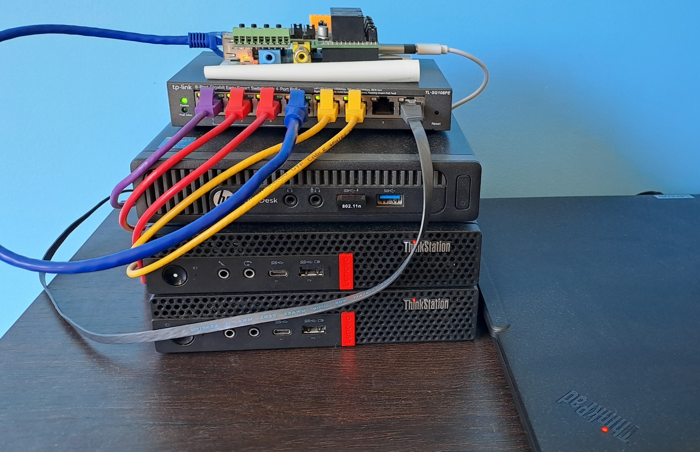

# Personal Home Lab (On-Prem)

Welcome to my personal home lab! :wave:  

This project provides an environment for self-hosting and experimenting with different technologies.  
A base for hands-on learning, developing knowledge and improving my skills in GitOps and Infrastructure-as-Code.  
Bootstrapped, deployed, and managed using Terraform and CI/CD workflows.  

As a big fan of small tech (think micro-pcs, Raspberry Pi etc), a primary requirement is maintaining a small footprint for my on-prem environment. I aim to re-use as much existing hardware as possible, recycling second hand gear and giving it a new life in my lab. 

### 📎 Project Environments

- **On-Prem:** [Homelab](https://github.com/tim-shand/homelab)
- **Cloud:** [Azure](https://github.com/tim-shand/azure)

---

## :computer: Physical Hardware

### Hypervisors (Proxmox)

- 2x Lenovo Think Station P330 (Intel i5 9600T, 16GB DDR4, 250GB OS, 1TB ZFS pool). 
  - Running clustered [Proxmox VE](https://www.proxmox.com/en/products/proxmox-virtual-environment/overview) for VMs.  
  - Currently investigating NAS options to improve high availability and failover :eyes:. 
- 1x Raspberry Pi 1B+ (yes, very old)
  - Running as a QDevice, maintaining Proxmox cluster quorum [details on setup found here](https://www.tshand.com/p/home-lab-part-6-setup-qdevice-for-proxmox-quorum/).
  - Will be replaced and repurposed in future when I add a 3rd Proxmox node. 

### Networking

- **Switch:** TP-Link TL-SG108PE 8-Port Gigabit Easy Smart PoE Switch. 
  - Connecting nodes physically, providing outbound access to Internet via firewall connected to home WiFi network. 
- **Firewall:** HP EliteDesk G1 (Intel i5-4590T, 16 GB DDR3, 250 GB SSD). 
  - Running [OPNsense](https://opnsense.org/) providing firewall, DNS, VLAN and routing functionality. 
  - Separate VLANs for infrastructure, management and server workloads. 

---

## :hammer_and_wrench: Deployment Tool Set

- **[Terraform](https://www.terraform.io/)**
  - Provider agnostic IaC tool, free to use, plenty of discussion, guides and support available. 
  - Deploy and manage on-prem resources using dedicated providers. 
  - Other considerations: Pulumi, OpenTofu. 
- **GitHub Actions: Self-hosted Runners (PENDING)**
  - Extends GitHub Actions workflows to allow management of on-prem environments. 
  - Can be run on a dedicated VM within Proxmox. 
  - Considering migration to GitLab. 
- **Bash/Powershell**
  - Bootstrapping and misc utility scripts. 

---

## :jigsaw: Workloads

- **Firewall/Router:** Virtualized [pfSense](https://www.pfsense.org/download/) VM (for internal lab use). 
- **Virtual Machines:** Management/jump host servers, CI/CD runners, test and misc utility VMs. 

---

## :memo: To Do

- [ ] Review bootstrapping process. 
- [ ] Setup self-hosted GitHub Runner on-prem. 
- [ ] Review option for migration to GitLab. 
- [ ] Investigate Docker hosts with HA/failover. 
- [ ] Investigate Kubernetes deployments. 
