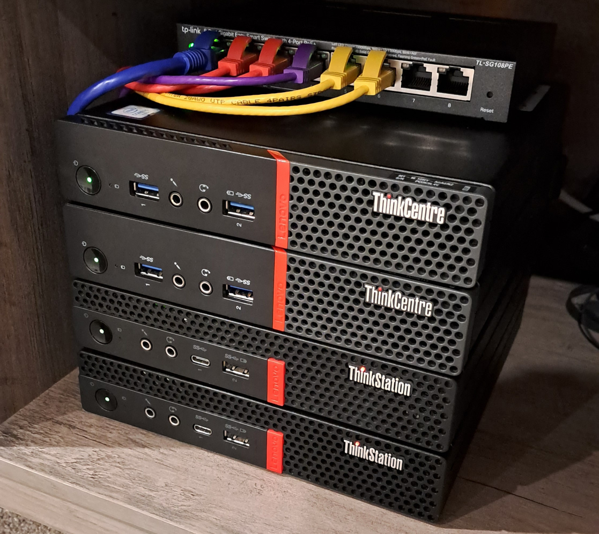
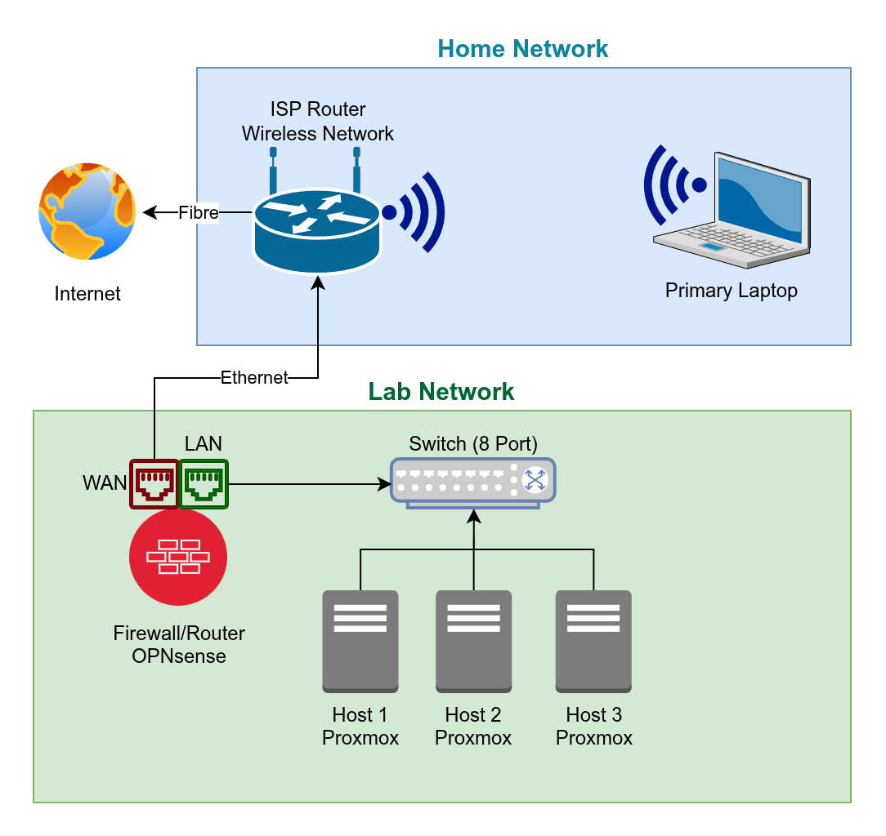

# Home Lab

Welcome to my personal home lab! :wave:  

This project provides an environment for self-hosting and experimenting with different technologies.
A base for hands-on learning, developing knowledge and improving my skills.

As a big fan of small tech (micro-pcs, Raspberry Pi etc), a primary requirement is maintaining a small footprint for my on-prem environment.
I aim to re-use as much existing hardware as possible, recycling second hand gear and giving it a new life in my lab.

_For more in-depth details on how to configure Proxmox and other platforms, check out my website where I share guides and other articles._

🌏 [Personal Website](https://tshand.com/)

---

## 🎯 Goals & Objectives

- Use existing or refurbished hardware, reducing cost and maximizing technology lifespan.
- Isolation of networks, providing a separation of lab and existing home networks.
- Implement high availability, redundancy and best practices where applicable.
- Utilise both infrastructure and configuration as code where possible.
- Automate deployments, using Git for version control and workflows/pipelines for CI/CD.
- Maintain a small physical footprint, for both atheistic and practicality purposes.

---

## 🏛️ Design & Architecture

The design for this project places the home lab network behind the existing home network. This design is relatively simple and allows room for expansion.

- The home lab network exists **behind** the lab firewall, connected to the existing home network.
- The firewall WAN address is provided by the ISP provided WiFi router using a DHCP reservation.
- A static route entry is added to the ISP router to direct connections from the home network into the lab network via the firewall WAN IP.
- Virtual server workloads are isolated on dedicated VLANs for improved security and network traffic control.

---

## 🖥️ Hardware & Components

### 🏭 Hypervisors (Proxmox)

Refurbished mini-PCs running [Proxmox VE](https://www.proxmox.com/en/products/proxmox-virtual-environment/overview) as the virtualisation layer. 
Chosen due to being free (zero-cost) and open source, with extensive vendor and user documentation available.

**Lenovo ThinkCentre P330 Tiny (x2)**

- Production nodes 1 & 2, chosen for physical footprint and dual M.2 NVMe slots.
- ZFS pools configured with replication enabled for priority workloads.
- PCIe slot available (requires specific PCIe riser), providing extra LAN port or storage capabilities.
- M.2 WiFi card slot now in use by 2.5Gb Ethernet adapter, providing dedicated workload interface.

| CPU                            | Memory     | Storage (OS) | Storage (Data) | Networking                          |
| ------------------------------ | ---------- | ------------ | -------------- | ----------------------------------- |
| Intel i5-9500 (6C/6T, 3.0 GHz) | 16 GB DDR4 | 256 GB NVMe  | 1 TB NVMe      | Integrated NIC + 2.5GbE M.2 adapter |

**Lenovo ThinkCentre M700 (x1)**

- Considered a test/dev node, similar family as the P330 nodes.
- Replaced old Raspberry Pi (QDevice), adding a proper third node to the cluster.
- Single disk node with no ZFS or secondary network interface (yet).

| CPU                             | Memory    | Storage (OS)    | Storage (Data) | Networking     |
| ------------------------------- | --------- | --------------- | -------------- | -------------- |
| Intel i5-6400T (4C/4T, 2.2 GHz) | 8 GB DDR4 | 256 GB SATA SSD | N/A            | Integrated NIC |

**Raspberry Pi 1B+** _(Decommissioned)_

- Was running as a QDevice, maintaining Proxmox cluster quorum (required for two-node clusters).
- Replaced by the Lenovo M700 and awaiting a new purpose as environment monitoring agent.

### 🧱 Firewall (OPNsense)

A twin of my third Proxmox node. A second Lenovo M700 running [OPNsense](https://opnsense.org/get-started/).
Dedicated as a physical firewall appliance, using the ISP provided router as upstream WAN gateway.

**Lenovo Thinkcentre M700**

| CPU                             | Memory    | Storage (OS)    | Storage (Data) | Networking                          |
| ------------------------------- | --------- | --------------- | -------------- | ----------------------------------- |
| Intel i5-6400T (4C/4T, 2.2 GHz) | 8 GB DDR4 | 256 GB SATA SSD | N/A            | Integrated NIC + 2.5GbE M.2 adapter |

> Check out [this blog post](https://tshand.com/posts/homelab-08-update/#new-hardware--components) for details on replacing the original M.2 WiFi adapter with 2.5Gb Ethernet adapter.

### 🌐 Networking

**Switch (TP Link TL-SG108PE)**

- Basic 8 port "smart" managed switch, supporting VLANs (802.1Q and port based).
- Capable of PoE (Power over Ethernet), although this is not being used currently, and has been disabled.

---

## 🧩 Workloads

- Self-hosted GitLab instance for repo mirroring and executing pipelines locally.
- Virtualized [pfSense](https://www.pfsense.org/download/) VM (for internal lab use).
- Management and jump host servers, test and misc utility VMs.

---

## 🛠️ Tools & Utilities

- **[Terraform](https://www.terraform.io/)**
  - Provider agnostic IaC tool, free to use, plenty of discussion, guides and support available.
  - Deploy and manage resources using dedicated providers.
  - **Alternatives:** Pulumi, OpenTofu.
- **Bash/Powershell**
  - Bootstrapping and misc utility scripts.

---

## 📚 Documentation

Please refer to the [docs](docs/) directory for operational guides on how this environment is configured.

---
