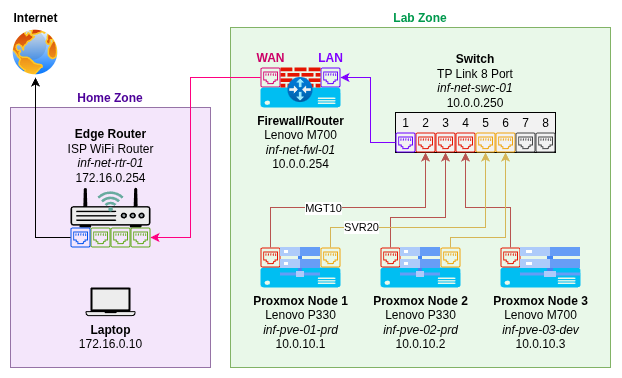
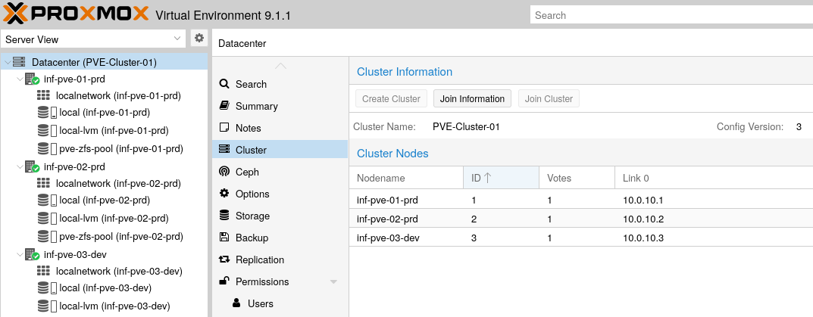
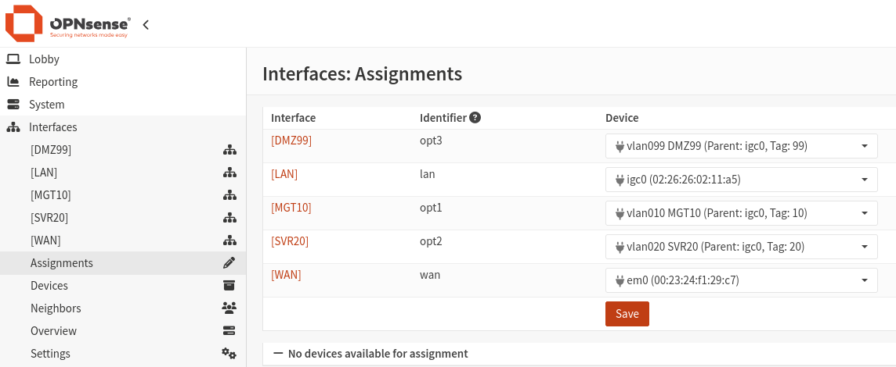
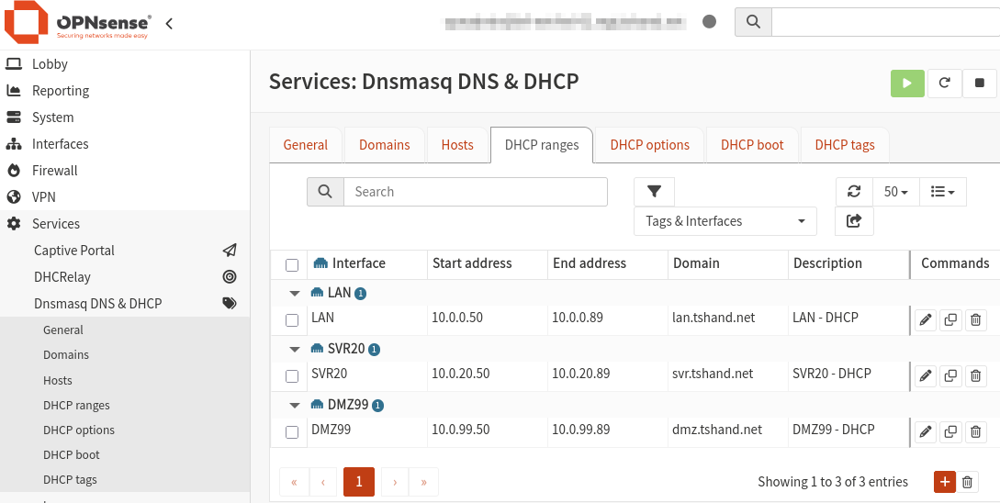
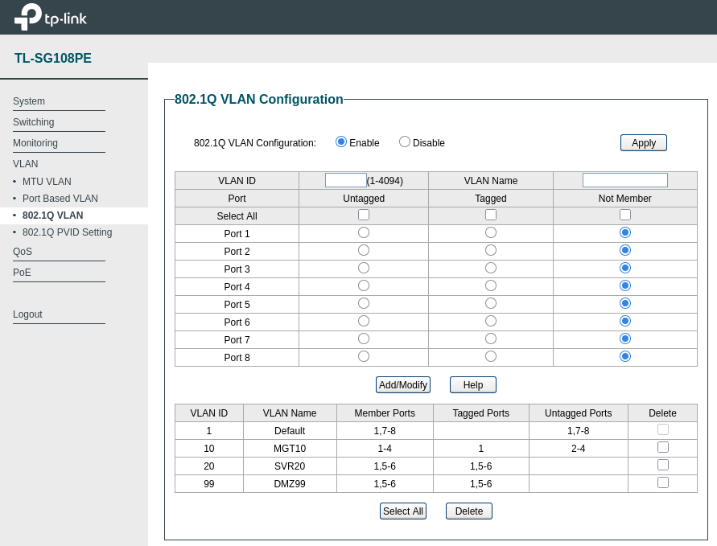

# Architecture & Design

This document provides an overview of the physical and virtual architecture used within the lab environment. 

## 🌟 Overview

- The lab zone is positioned _behind_ my home network ISP router (home zone).
- The OPNsense firewall provides a security layer between the `home` network and the `lab` network.
  - The WAN interface is connected to the ISP router via Ethernet and receives and IPv4 address via static DHCP entry.
  - The LAN interface on the OPNsense firewall is connected to a managed switch and acts as the parent interface for VLANs.
- A static route is added to the ISP router to allow traffic from the home network destined for the lab zone to go via the OPNsense WAN address.
- Aliases are used in OPNsense to group trusted devices and destination services, making firewall rules easier to implement.
- Proxmox Software Defined Networking (SDN) is used to provide VMs with virtual networks pre-configured for specific VLANs.
- VLANs are configured in OPNsense, Proxmox SDN (VNets), and on the managed switch to separate management traffic from workload traffic.



---

## 🏢 Hypervisor Cluster

- The cluster is comprised of three physical hosts, each running [Proxmox VE](https://www.proxmox.com/en/products/proxmox-virtual-environment/overview).
- Each nodes primary NIC is connected via Ethernet to a managed switch on ports 2, 3 and 4.
  - Only two nodes currently have a secondary NIC for dedicated workload traffic.
  - These NICs are connected to the managed switch on ports 5 and 6.
- Prior to the addition of the third node, a Raspberry Pi **QDevice** was used to provide the missing third quorum vote.
  - This is no longer required and has been decommissioned, pending re-purpose as an environmental monitoring device.
  - Details on QDevice configuration can be found [here](https://tshand.com/posts/homelab-04-proxmox-cluster-qdevice/).

> [!TIP]
> Guides for the initial setup and configuration of Proxmox can be found on my [website](https://tshand.com/tags/homelab/).



### Software Defined Networking (SDN)

Software Defined Networking allows the use of virtual networks for Proxmox resources (VMs and containers).
These virtual networks (VNets) allow segregation between workloads by separating them into isolated Layer 2 or Layer 3 network segments.
This simplifies network management and reduces manual VLAN configuration, as the VLAN tag IDs can be assigned to the entire VNet.

- **Zones:** Define the SDN backend (`Simple`, `VLAN`, `VXLAN`, `EVPN`) and determine how virtual networks are implemented across the cluster.
- **VNets:** Represent the virtual networks that VMs and containers connect to. VNets are members of a single zone.
- **Subnets:** Define the IP addressing for a VNet, including gateway information and IP address management (IPAM). Subnets are members of a single VNet.

The majority of VNets in Proxmox are assigned VLAN tags. This helps to simplify VLAN assignment. 
Rather than tagging each individual VM or containers, resources can be assigned to a "pre-tagged" VNet.
For example, if a resource is assigned to a VNet with tag 20, the traffic from that resource will inherit that VLAN tag.

> [!NOTE] 
> Some Proxmox configuration, including Software-Defined-Networking is defined and managed via Terraform.

---

## 🌍 Edge Router (ISP Router)

The ISP provided router provides the main `home` network, providing NAT gateway and outbound Internet access for the entire network.

- This device provides a wireless connection for personal laptops, mobiles, TVs, media devices etc.
- The OPNsense firewall **WAN interface** is connected to this router via Ethernet.
- Any device connected to the ISP router is considered **WAN-side** from the perspective of the lab network.

### DHCP Reservation

- A DHCP reservation is added to ensure that the IPv4 address of the OPNsense WAN interface is preserved through reboot events. 
- Without this, the OPNsense WAN interface _could_ receive a different IP address from the ISP router when the lease expires for the automatically assigned IP.

```text
MAC Address: 00:23:24:xx:xx:xx
IP Address:  172.16.0.250
Host Name:   inf-net-fwl-01
```

### Static Route

- A static route configured on the ISP router provides a pathway for WAN-side devices where the target destination address is within the home lab network.
- The network address uses the subnet mask of `255.255.0.0` (/16) to ensure that all VLANs and home lab subnets will be directed via the OPNsense WAN interface.

```text
Source:       Laptop (172.16.0.10)
Destination:  OPNsense LAN Address (10.0.0.254)
Static Route: 10.0.0.0/16 --> 172.16.0.250 (OPNsense WAN address)
```

**Example Traffic Flow:**

```text
Laptop (172.16.0.10)
    |
ISP Router/Home Network (172.16.0.254)
    |
OPNsense WAN: (172.16.0.250)
    |
OPNsense LAN: (10.0.0.254)
- VLAN10 (MGT10): (10.0.10.0)
- VLAN20 (SVR20): (10.0.20.0)
- VLAN99 (DMZ99): (10.0.99.0)
```

---

## 🚧 Firewall (OPNsense)

### Outbound NAT

Outbound NAT is disabled in OPNsense, as the upstream ISP router provides the NAT functionality for outbound Internet access.
Disabling this prevents potential issues with "double NAT" situations. 

- **Disable Outbound NAT:** `Firewall > NAT > Outbound > Disable outbound NAT rule generation [CHECKED]`

### Reply-To

Keeping reply-to enabled allows state tracking and return traffic handling to function correctly when accessing devices such as Proxmox hosts from the upstream home network. During testing, disabling reply-to caused connectivity issues.

- **Enable Reply-To:** `Firewall > Settings > Advanced > Disable reply-to on WAN rules [UNCHECKED]`

### Firewall Rules + Alias Groups

Aliases are used to group common hosts or ports, making the generation of firewall rules much easier.
Rather than assigning a rule per host and per port, alias groups enable a single rule to apply to multiple hosts across multiple ports.

**Example:** Alias Groups

- Alias group for Proxmox nodes and network device web UI addresses.
- Alias group for common management UI and web ports.

| Name              | Type      | Content                         | Description         |
| ----------------- | --------- | ------------------------------- | ------------------- |
| WAN_Trusted       | Host(s)   | 172.16.0.10, 172.16.0.11        | WAN Trusted Devices |
| MGT_Hosts_Proxmox | Host(s)   | 10.0.10.1, 10.0.10.2, 10.0.10.3 | Proxmox Nodes       |
| MGT_Hosts_Network | Host(s)   | 10.0.10.250, 10.0.10.254        | Network Devices     |
| Ports_Mgmt        | Port(s)   | 22, 80, 443, 8006               | Management Ports    |
| Ports_Web         | Port(s)   | 80, 443                         | Web Only Ports      |

**Example:** Firewall Rules 

- Inbound from trusted WAN devices (alias) to Proxmox (alias) on ICMP (ping, traceroute etc).
- Inbound from trusted WAN devices (alias) to network devices (alias for switch, firewall) on ICMP.
- Inbound from trusted WAN devices (alias) to Proxmox (alias) on management ports.
- Inbound from trusted WAN devices (alias) to network devices (alias) on web only ports.

| Action | Interface | Version | Protocol | Source      | Port | Destination       | Port       |
| ------ | --------- | ------- | -------- | ----------- | ---- | ----------------- | ---------- |
| PASS   | WAN       | IPv4    | ICMP     | WAN_Trusted | *    | MGT_Hosts_Proxmox | *          |
| PASS   | WAN       | IPv4    | ICMP     | WAN_Trusted | *    | MGT_Hosts_Network | *          |
| PASS   | WAN       | IPv4    | TCP/UDP  | WAN_Trusted | *    | MGT_Hosts_Proxmox | Ports_Mgmt |
| PASS   | WAN       | IPv4    | TCP/UDP  | WAN_Trusted | *    | MGT_Hosts_Network | Ports_Web  |

### VLANs

- Using VLANs allows separation of traffic for different segments of the lab environment. 
- This helps to reduce congestion and adds an extra layer of security by keeping management and workload traffic separated on their own virtual networks (VLANs).

**VLAN Configuration:**

| Device  | Parent       | VLAN Tag | VLAN Priority                | Description |
| ------- | ------------ | -------- | ---------------------------- | ----------- |
| vlan010 | igc0 \[LAN\] | 10       | Network Control (7, highest) | MGT10       |
| vlan020 | igc0 \[LAN\] | 20       | Best Effort (0, default)     | SVR20       |
| vlan099 | igc0 \[LAN\] | 99       | Best Effort (0, default)     | DMZ99       |



### DHCP

DHCP is used to provide automatic IP addressing to devices on networks.
This ensures that connected devices are able to communicate with the need to set a static IP.

- **Enable DHCP listener for VLANs:** `Services > Dnsmasq DNS & DHCP > General`.
- **Configure DHCP scopes per VLAN:** `Services > Dnsmasq DNS & DHCP > DHCP Ranges`

> [!NOTE]
> DHCP is not used for the MGT10 VLAN. Being a privileged management network, it uses static addressing only.

| Interface  | Start Address | End Address | Domain         | Description  |
| ---------- | ------------- | ----------- | -------------- | ------------ |
| LAN        | 10.0.0.50     | 10.0.0.89   | lan.tshand.net | LAN - DHCP   |
| vlan020    | 10.0.20.50    | 10.0.20.89  | svr.tshand.net | SVR20 - DHCP |
| vlan099    | 10.0.99.50    | 10.0.99.89  | dmz.tshand.net | DMZ99 - DHCP |



---

## 🔀 Managed Switch

This device is the backbone of the lab network. It is used to connect devices, configure VLANs and carry network traffic.
VLANs are configured to carry traffic on ports marked as both `tagged` and `untagged`.

- **Tagged:** Ethernet frame contains a VLAN ID in its header. 
  - Used between VLAN-aware devices (VMs, switches, wireless APs, routers).
- **Untagged:** Ethernet frame has no VLAN ID in its header.
  - The switch uses the PVID (Port VLAN ID) to decide which VLAN to assign the frame to.
  - Setting untagged VLAN ID for workload ports (5, 6, 7) to 99, keeping them off default of ID 1.

### 802.1Q VLAN Settings

| VLAN ID  | VLAN Name | Member Ports | Tagged | Untagged |
| -------- | --------- | ------------ | ------ | -------- |
| 1        | Default   | 1, 7-8       |        | 1, 7-8   |
| 10       | MGT10     | 1-4          | 1      | 2-4      |
| 20       | SVR20     | 1, 5-7       | 1, 5-7 |          |
| 99       | DMZ99     | 1, 5-7       | 1, 5-7 |          |

### 802.1Q PVID Settings

The PVID defines the default VLAN ID assigned to any **untagged** traffic on the specified port.

| Port     | 1   | 2   | 3   | 4   | 5   | 6   | 7   | 8   |
| -------- | --- | --- | --- | --- | --- | --- | --- | --- |
| **PVID** | 1   | 10  | 10  | 10  | 99  | 99  | 99  | 1   |



---
