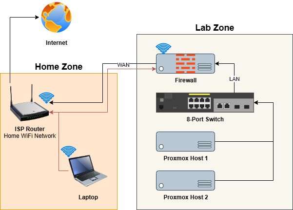

# Home Lab - Part 1: Getting Started

## Introduction

This is the first article in a series where I rebuild my home lab environment from scratch. The process will involve using both existing and newly purchased hardware, the majority of which is pre-owned, sourced from online trading platforms such as Trademe, Amazon and Facebook Marketplace. I decided to revisit this project as the documentation for my original build was lacking segments, and had become outdated.

One of the future goals in this project is to utilize automation via **Infrastructure-as-Code**, which along with various scripts and other pieces of automation will be available in my Github repo [tim-shand/homelab](https://github.com/tim-shand/homelab) as they are produced.

- **NOTE:** Some steps in this guide may not be applicable or suit your requirements, and can therefore be skipped if needed. I aim to keep the information as accurate as possible, however some details and decisions may change over the course/lifespan of the project.

### Key Objectives

- Build a new home lab from the ground up.
- Use existing or second-hand hardware, reducing cost and maximizing technology lifespan.
- Implement high availability, redundancy and best practices where applicable. 
- Maintain a small physical footprint, for both atheistic and practicality purposes.

---

## Components

### Hypervisors

- Repurposed mini-PCs are great for this as they are low cost and have a small foot print.
- **Hardware:** 2x Lenovo Thinkcentre P330 Tiny
	- **CPU:** Intel i5-9500 (6 Core, 6 Thread, 3.00 GHz).
	- **MEM:** 16GB (DDR4, 1x 16GB SODIMM).
	- **SSD:** 256GB NVMe (shipped with only 1x disk installed - 1x SATA, 2x M.2 total).
	- Chosen for minimal size, dual M.2 slots for storage, and the additional PCIe slot that can be used for adding an extra low-profile NIC card with a PCIe riser. 
- **Software:** [Proxmox VE](https://www.proxmox.com/en/products/proxmox-virtual-environment/overview)
- **Future Upgrades/Improvements**
	- Additional PCIe cards for 2.5Gb ethernet (providing separate physical network for hosts).
	- Add a third Proxmox node for improved cluster high-availability.

### Networking

- **Switch:** TP Link TL-SG108PE (Easy Smart PoE Switch)
	- Although not a proper Layer-3 switch, it provides some management features such as VLANs and port mirroring. 
	- While it provides PoE (Power over Ethernet), this won't be utilized at this stage, and can be disabled via the web GUI interface.
- **Firewall:** HP Elitedesk 800 G1 Mini
	- **CPU:** Intel i5-4590T (4 Core, 4 Thread, 2.00 GHz).
	- **MEM:** 10GB (DDR3, 1x 8GB, 1x 2GB SODIMM).
	- **SSD:** 256GB (SATA SSD).
	- Repurposed mini-pc from my previous Proxmox cluster.
	- Using a WiFi dongle for the WAN-side connection. Not really ideal, but my ISP router is at the other end of the house, and I'd rather keep this build in my office.
	- Running [OPNsense](https://opnsense.org/get-started/) (experienced setup issues with [pfSense](https://www.pfsense.org/), see upcoming guide for more details).

---

## Design

The design for this project will sit behind my existing home network, which will remain untouched for now, other than a DHCP reservation set on my ISP-provided router for the firewall WAN connection. The structure is relatively simple and allows room for expansion. The firewall in the lab zone will allow inbound HTTPS traffic from the WAN side to the firewall management portal. This is not typically advised, however this network is protected behind my existing internal network and will make things easier during the _initial configuration_ and setup. This access will be reverted once in production. 

The two mini PCs will provide the hypervisor layer, allowing me to virtualize my server and container workloads. Any inbound network access required will be made within the firewall.

---

## Next Steps

In the first stage of the project, I setup and configure the firewall while waiting for the hypervisor hardware (mini PCs) to arrive via post. This will also allow me to implement test rules to ensure that the design will work as expected. From there, the build will continue with configuring the Proxmox hosts.
