# Home Lab - Part 2: Firewall Setup & Configuration

## Getting Started

This article demonstrates the process I followed (and issues experienced) when configuring the firewall used for my home lab.

I wanted to maintain a separation of the lab environment from my home network, but still allow for access to the lab from my desktop. Using a firewall between the lab and home network ensures the lab is protected and allows me to limit network traffic in both directions by configuring rules. 

After clicking "buy now" on two **Lenovo ThinkStation P330 Tiny** mini-PCs from the kiwi favourite buy/sell platform [Trademe](https://www.trademe.co.nz) to be used for the hypervisors, I decided to get started on setting up the hardware to provide firewalling and routing, utilizing an **HP EliteDesk 800 G1 Mini** left over from my last home lab build. 

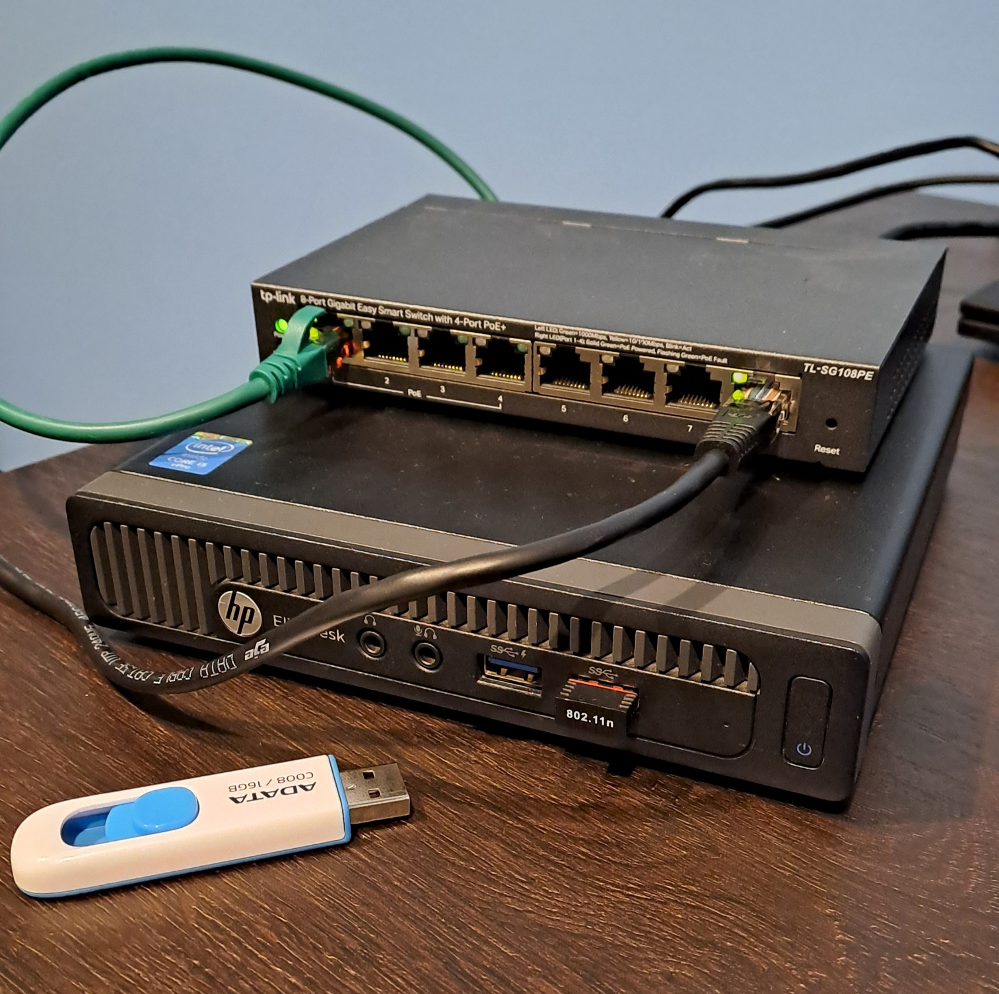

This crucial piece of infrastructure will be responsible for protecting the network from malicious or unwanted traffic, handling routing between internal and external networks, and also providing addressing via DHCP for specific vLANs in the future. 

### Requirements

- USB Drive for ISO image (4GB+).
- Host machine with at least 2GB RAM and 64-bit CPU.
- OPNsense USB Image (VGA) ([download here](https://opnsense.org/download/)).
- USB Imaging Software [Rufus](https://rufus.ie/en/).

### Issues with pfSense

Having used pfSense for firewalling in the past, I was excited to get started on the familiar process of booting from USB image and installing. However, the vendor Netgate made [changes to the installer](https://docs.netgate.com/pfsense/en/latest/install/install-pfsense.html) recently, one of those being a requirement for an active internet connection to proceed. 

After downloading and creating the bootable USB image, I discovered that the WiFi dongle was not available in the list of devices when selecting a connection for the WAN. This can be pretty typical for some FreeBSD-based and Linux systems. 

I found that by exiting the setup process, I was able to configure the wireless adapter and connect it to my home WiFi network successfully. However, when running the installer again, it refused to acknowledge the adapter in the list of available connections when selecting a device for the WAN, showing only the onboard ethernet device.

This wasn't going to work for my situation, as I plan to use the WiFi dongle for the WAN connection due to physical logistics, and not having wired ethernet in the house. If it wasn't for this limitation, pfSense would likely have worked out fine - however I wasn't prepared to move the lab build into my living room to access the ISP router.

### OPNsense (Chosen Alternative)

Originally forked from pfSense, [OPNsense](https://opnsense.org/) is another great option for an open-source firewall/routing solution which I've also used in the past. Unlike with pfSense, after booting from a downloaded USB image, the WiFi adapter was automatically detected and presented as an option for the WAN interface. Hence, I have chosen to proceed with OPNsense. Easy win for OPNsense. 

---

## Installation

The process begins with downloading the OPNsense image from the [OPNsense website](https://opnsense.org/download/) and writing it to USB. I like to use [Rufus](https://rufus.ie/en/) when creating bootable USB images, although the [Getting Started](https://opnsense.org/get-started/) page on the OPNsense site provides command line instructions for Windows, Linux and MacOS users if that is your preference.

With the USB image setup, proceed to boot the EliteDesk from the USB stick and allow the image to boot up into the installation menu. When presented with the OPNsense Boot Menu, allow it to continue with autoboot (no input required). 

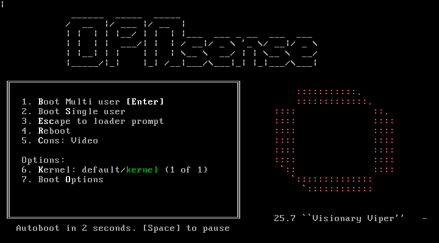

During the initial boot up process, OPNsense will try to detect the network configuration unless manually stopped during the autoboot process. Typically, it will select the first device with an existing IP addresses assigned via DHCP as the WAN interface. If custom WAN/LAN configuration is required or preferred (such as in my case), **press any key** at the prompt. 

The installer will prompt asking to configure both LAGGS and VLANS, this can be skipped unless desired. Otherwise this can be configured via the web interface later on. 

- Enter the interface name to be used as WAN.
- Enter the interface name to be used as LAN.
- **Optional:** Enter the interface name to be used as OPT.
	- This can used as a separate interface for firewall management or wireless access points.

The image below shows the output of a test VM I used to boot into OPNsense for _demonstration_ purposes. The actual WiFi interface name in my case was referenced as "rtwn0". 

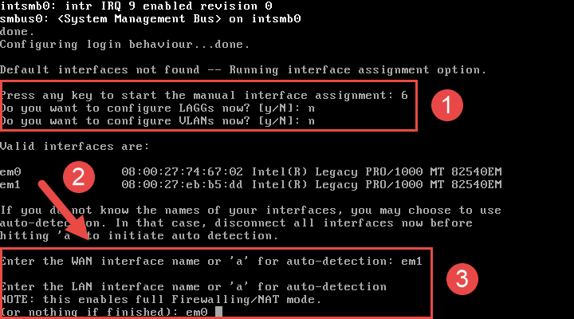

OPNsense will continue to load until presenting the completing the initial post-boot configuration. 

- **NOTE:** The default behavior of OPNsense is to boot into a live environment, therefore installation steps are still required post-boot process. 

When presented with the post-boot configuration screen, login using the default **installer** credentials provided on the [Getting Started](https://opnsense.org/get-started/) page. 

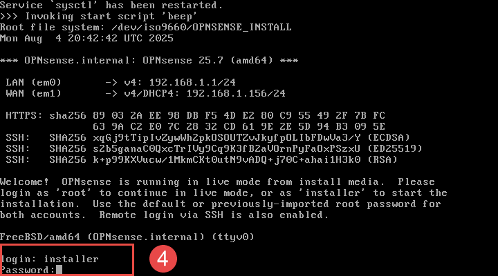

Proceed to follow through the steps of the installer, making any changes necessary to suit. 

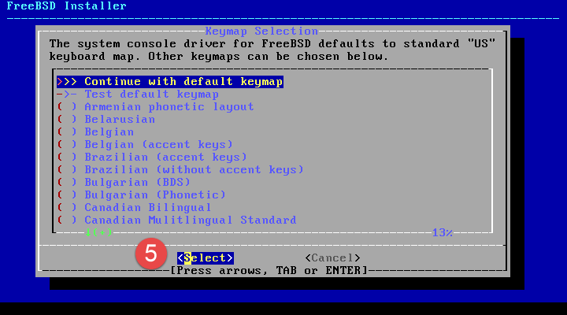

When selecting filesystem configuration, ZFS with striping is sufficient for my requirements as the device only has the one SSD available.  

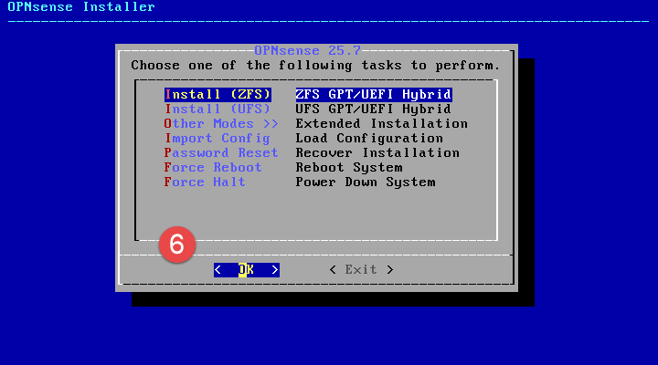
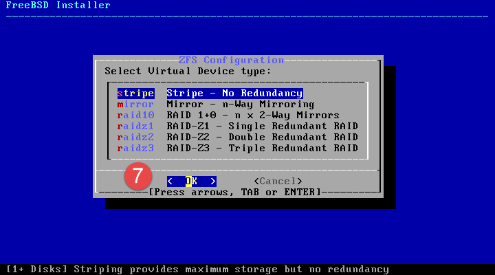

Select the disk to install OPNsense on, making sure to use the `spacebar` button to select the item from the list.  
Select `Yes` when requested to confirm.

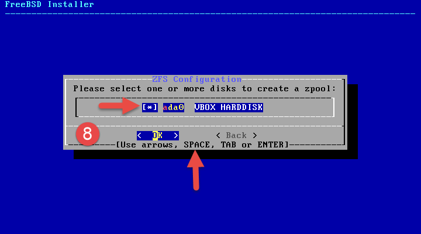
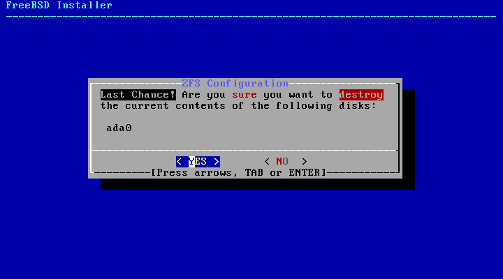
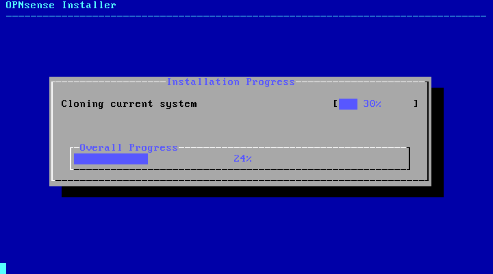

Allow the installer to complete. An option to change the root account password is offered.  
This can be changed later on via the web interface if skipped at this point.

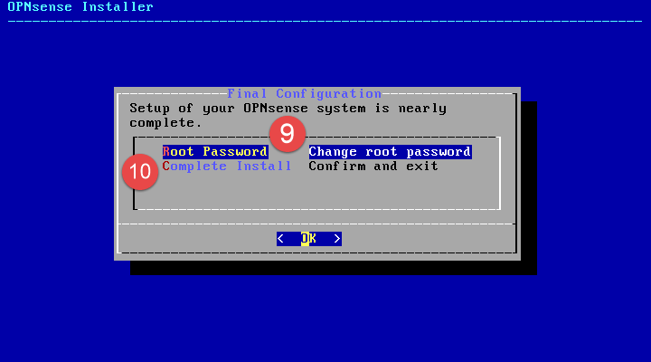
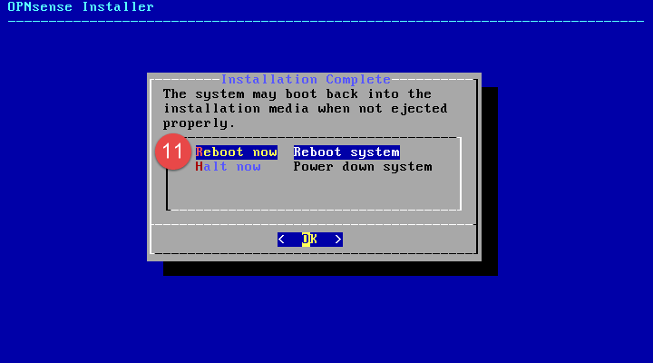

Once changed, select `Complete Install` to finish the install process, then select `Reboot Now`.

When OPNsense is done booting up, it will present the LAN interface IP address, on which the web interface can be accessed from another device. 

**By default:** 

- **WAN** interface is configured to wait for a DHCP provided address.
- **LAN** interface runs a DHCP server to provide IP addresses for other LAN-side devices. 

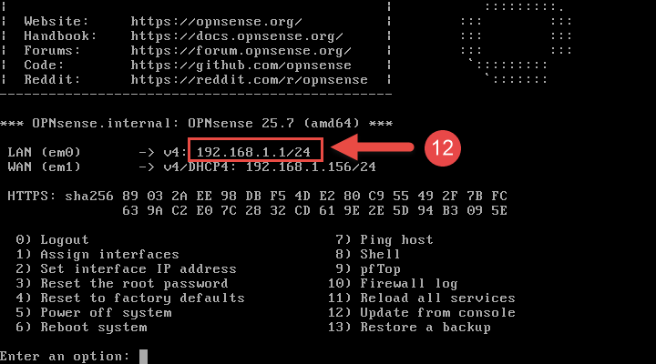

With this OPNsense device connected to an 8-port switch, my desktop is able to receive a DHCP provided IP address from the LAN-side DHCP server via Ethernet port, while still having Internet access via wireless connection to my home WiFi network. This allows access to the OPNsense web interface to perform initial configuration tasks. 

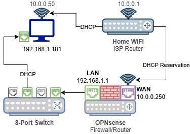

---

## Configuration

From a device on the same network as the LAN interface, navigate to the web interface IP address from a web browser. 

- **NOTE:** A page may appear stating that the website is not safe. This is due to the web interface using a self-signed certificate that an external authority cannot validate. This message can be ignored. 

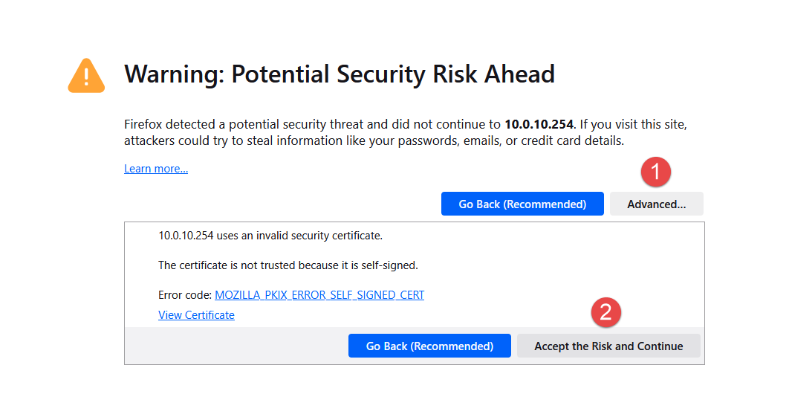

Enter the default username and **updated** password (changed in previous section).

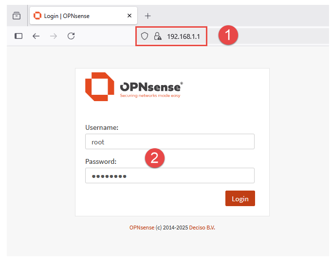

### Connect WAN to Home WiFi (USB Adapter)

Once logged into the web interface, locate the `Interfaces` menu item from the left side navigation panel, then select `[WAN]` from the list. 

- **Generic Configuration**
	- Ensure that the interface is **enabled**. 
	- **Optional:** Disable DHCP for IPv6.
- **Common wireless configuration**
	- **Standard:** 8011ng (or higher if available)
- **Network Specific Wireless Configuration**
	- **Mode:** Infrastructure (BSS).
	- **SSID:** Enter the network name for home wireless network.
	- **Minimum Standard:** Select the highest standard supported by USB WiFi adapter (802.11n in my case, a limitation of the WiFi dongle).
	- Enter password for home wireless network.
	- **WPA:** Enable WPA with WPA2 as the mode.

Click **Save**.

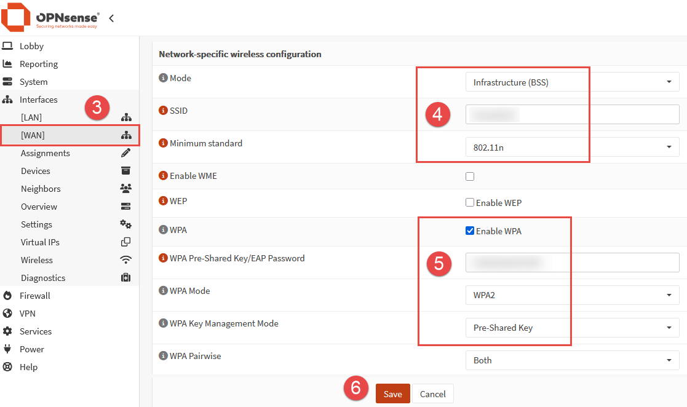

### Run Wizard

With OPNsense installed, now we can proceed to configure it. Navigate to `System > Configuration > Wizard` and click **Next**.

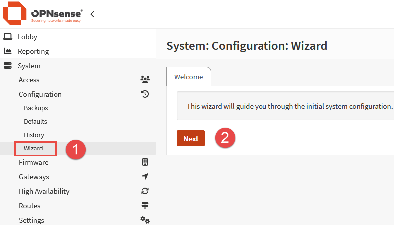

Set the desired hostname and domain name to use for the device. Select your time zone, leave the other options as default and click **Next**.

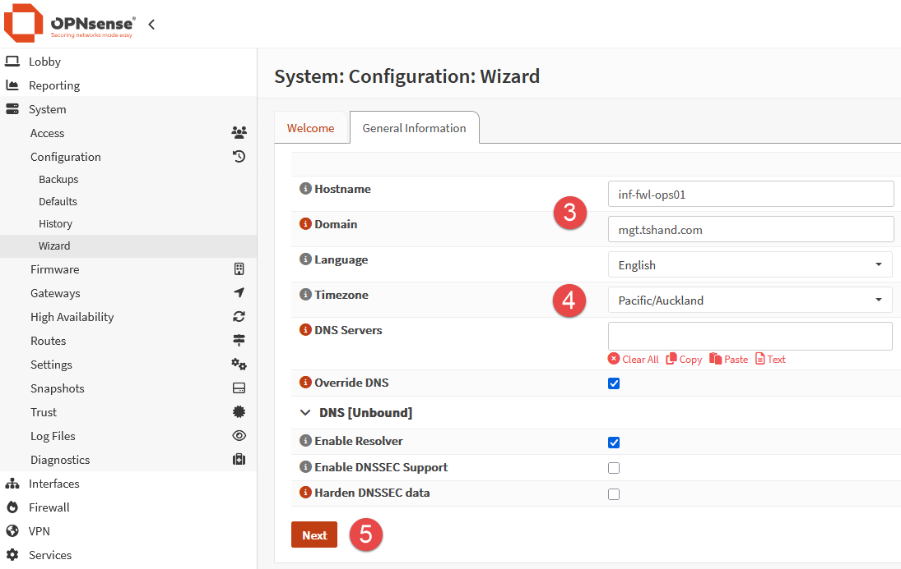

Ensure that DHCP is selected for the WAN connection **type**, leave the other options default or blank, and click **Next**.

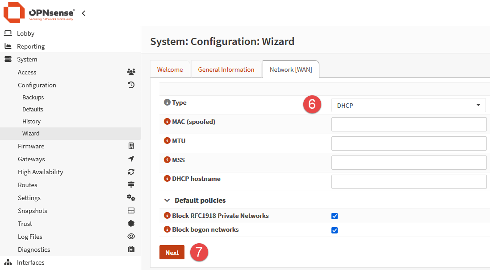

Set the desired LAN addressing. In my case, the default of `192.168.1.1/24` was replaced with a more favourable `10.0.10.254/24` address. When configuring a device such as a router/firewall in single node mode (no failover or HA), I prefer to use the last available address in the subnet. 

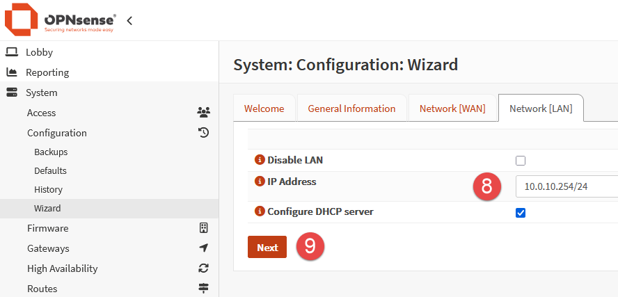

Set the root user password (a repeat task if set in the previous installation step). 

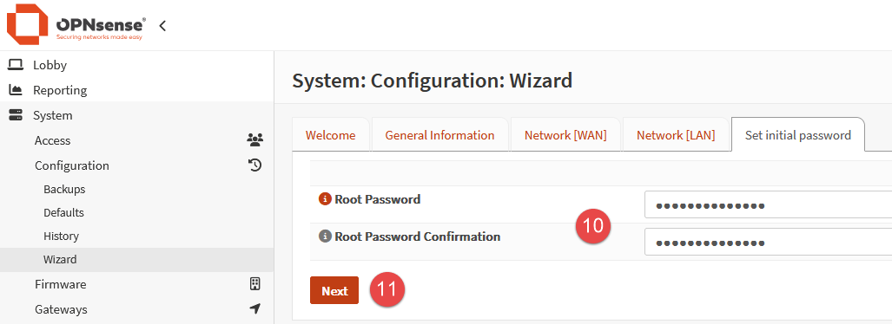

On the final **Finish** tab, click **Apply** to complete the wizard process. 

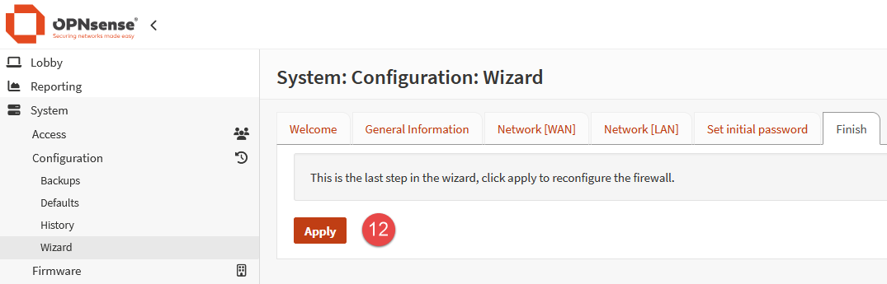

Once complete, the network interface on the client device (desktop) may need to be disabled/enabled to allow it to receive a new IP address from the updated DHCP scope. 

If running on Windows, open `cmd.exe` and execute the following:

```powershell
ipconfig /release "adapter name"
ipconfig /renew "adapter name"
```

If running on Linux, the commands may differ depending on the OS you are using.  
Some options to try are:

```bash
# Option 1
sudo ip link set <interface> down
sudo ip link set <interface> up

# Option 2
sudo nmcli connection down <connection_name>
sudo nmcli connection up <connection_name>

# Option 3
sudo ifdown <interface>
sudo ifup <interface>

# Option 4
sudo dhclient -r <interface>
sudo dhclient <interface>
```

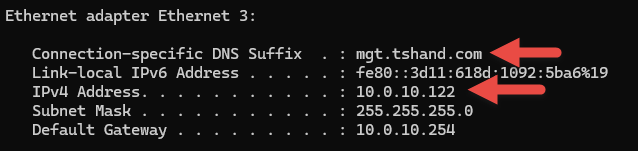

### Check for Updates

From the left side menu panel, select `System > Firmware > Status`.  
Click on the button labelled **Check for Updates**. 

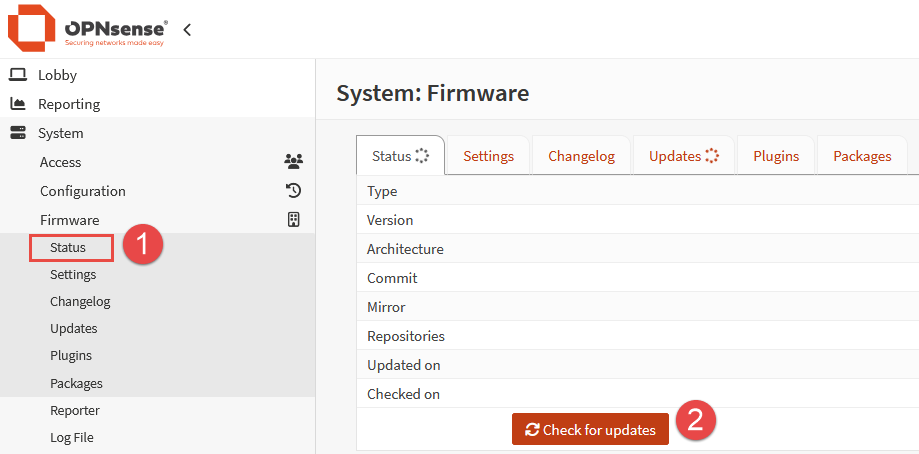

If updates are available, they will be listed in a table format showing the current and new versions.  
Click the **Update** button to proceed with the upgrade process. 

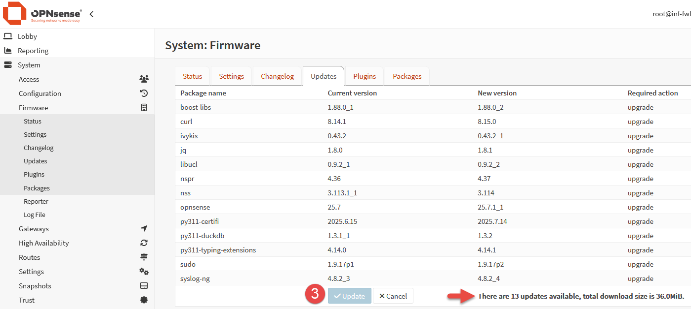

Once the downloaded updated are installed, the console with display "**DONE**" when complete. 

### WAN-Side Web Interface Access

**DISCLAIMER:** In most cases, allowing inbound WAN traffic to the web portal is discouraged, and should only be used in specific situations or during initial setup only. 

As I plan to occupy all 8 ports on my switch, I want the ability to access the OPNsense web portal from my laptop, which is connected to the home wireless network. The OPNsense **WAN interface** is a **client** of this wireless network, however OPNsense will block inbound traffic via the WAN interface by default. In typical use cases, this is perfectly fine, and the behavior is expected. 

Evidence of this can be found in the firewall logs, accessible from `Firewall > Log Files > Live View`. 

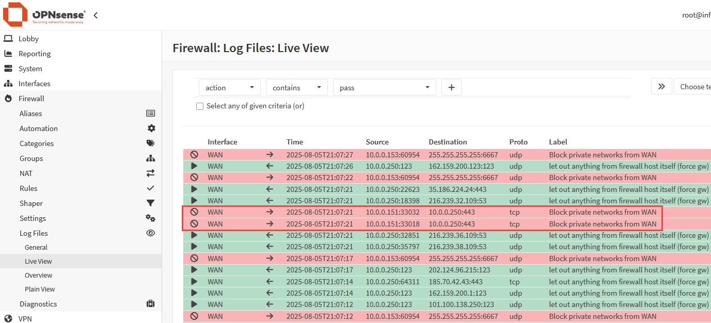

In order to remove the default rule blocking private networks from access via the WAN, navigate to `Interfaces > WAN` and unselect the option `Block private networks` and click **Save**. This will remove the default rule from it's position in the upper level of rule table, allowing a custom rule to be added to allow inbound connections from specific addresses. 

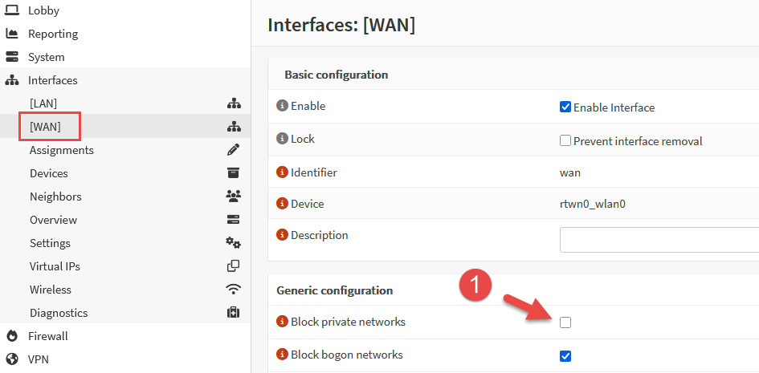

The second setting required to allow this to work can be found under `Firewall > Settings > Advanced`. Locate the setting `Disable reply-to` and enabled this tick box. Click **Save**. 

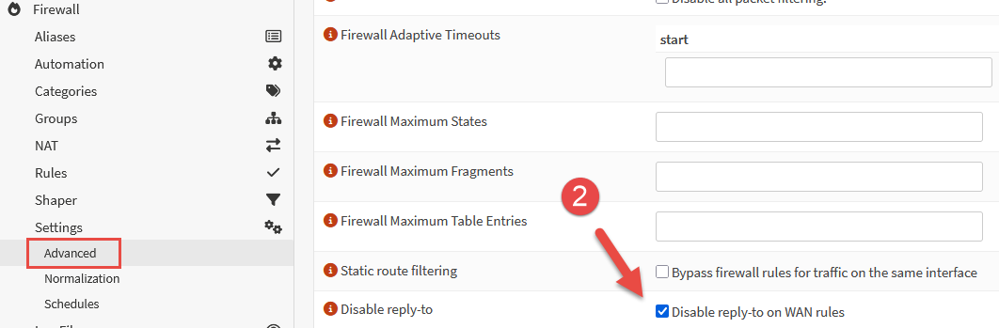

Lastly, we need to add a firewall rule to allow the connection, as all inbound WAN connections are blocked by default. Navigate to `Firewall > Rules > WAN` and click the small `+` icon on the right side of the rule table to create an new rule. 

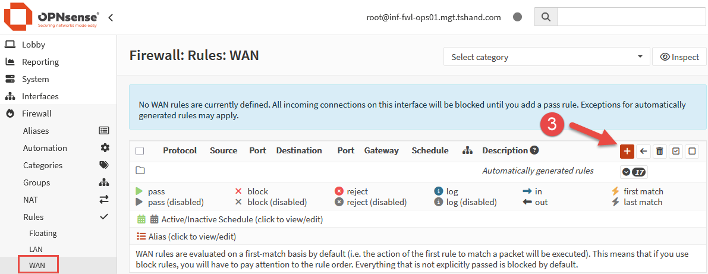

Ensure the following settings are configured:

```
Action: Pass
Interface: WAN
Direction: in
TCP/IP Version: IPv4
Protocol: TCP
Source: Single Host or Network
- Provide source IP for single device to access web portal via WAN IP.

Destination: WAN Address
Destination Port Range: HTTPS
Log: Enabled
Description: WAN_In_HTTPS_Laptop-Firewall
```

When the above settings are configured, click the **Save** button, followed by the **Apply Changes** button back on the rule table page.

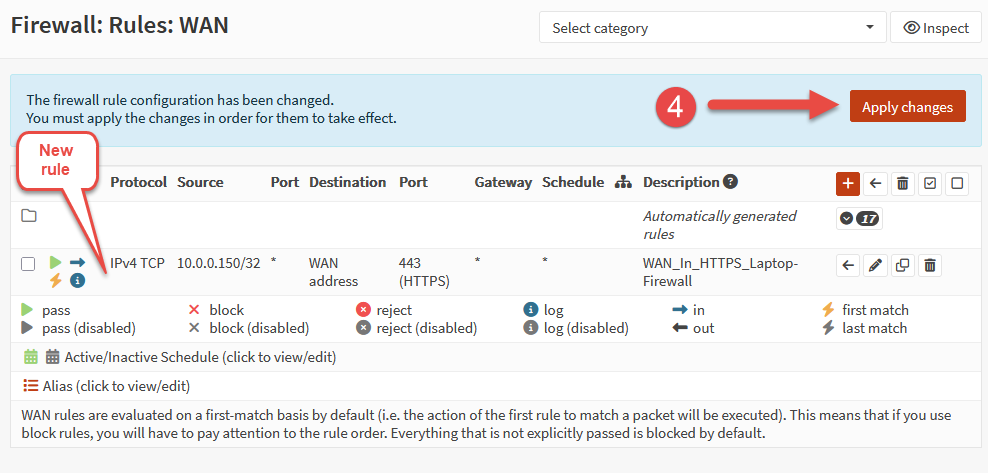

With the new rule in place, we can now see the inbound WAN traffic is being passed by the firewall for the specified IP address. 

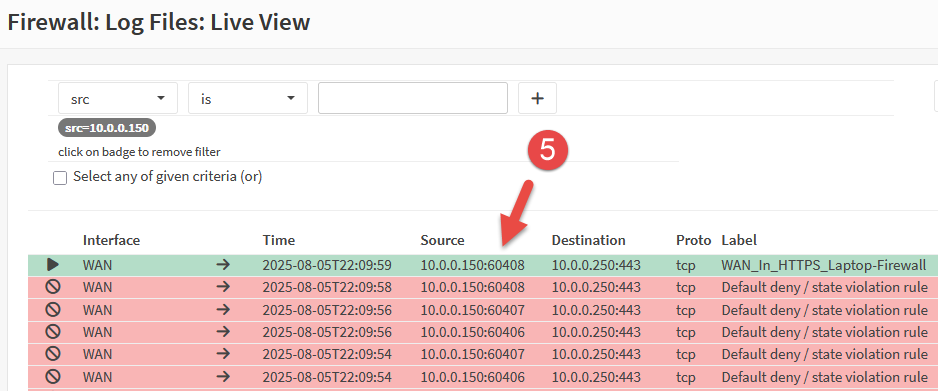

---

## Next Steps

I decided to run a [Speedtest](https://speedtest.net) to check the Internet connection speed from within the LAN-side of the firewall. As suspected, the WiFi adapter was **massive** bottle neck. Averaging 8.5 Mbps download and 4.3 Mbps upload. Pretty terrible numbers compared to my home WiFi where I can consistently reach download speeds over 200 Mbps.

Based on the disappointing results of the speed test, I plan to acquire a new WiFi adapter that supports 801.11ax and test the speed again. **Spoiler:** FreeBSD, the OS that OPNsense runs on, does not currently have great driver support for WiFi 6 (802.11ax). 

With the basic configuration now in place, further tweaking and adjustments can be made to DHCP scopes, reservations, user management and modifying Lobby Dashboard layouts etc. 

For more information on other areas on OPNsense to explore, including suggested configuration settings, visit the [OPNsense Docs](https://docs.opnsense.org/manual/install.html) for more details. 

---

_Cover photo by <a href="https://unsplash.com/@thomasjsn?utm_content=creditCopyText&utm_medium=referral&utm_source=unsplash">Thomas Jensen</a> on <a href="https://unsplash.com/photos/black-network-switch-with-cables-ISG-rUel0Uw?utm_content=creditCopyText&utm_medium=referral&utm_source=unsplash">Unsplash</a>_