## Overview

This article describes the steps taken to install and configure two Proxmox nodes on repurposed mini PCs, following on from the previous guide where the firewall was setup to run OPNsense. 

With the recent arrival of two **Lenovo ThinkStation P330 Tiny** PCs, it was time get started on the Proxmox build. These two machines will provide the hypervisor layer where VMs and container workloads can be deployed and run. The goal is to join them to a **cluster**, allowing the sharing of resources and failover capability. 

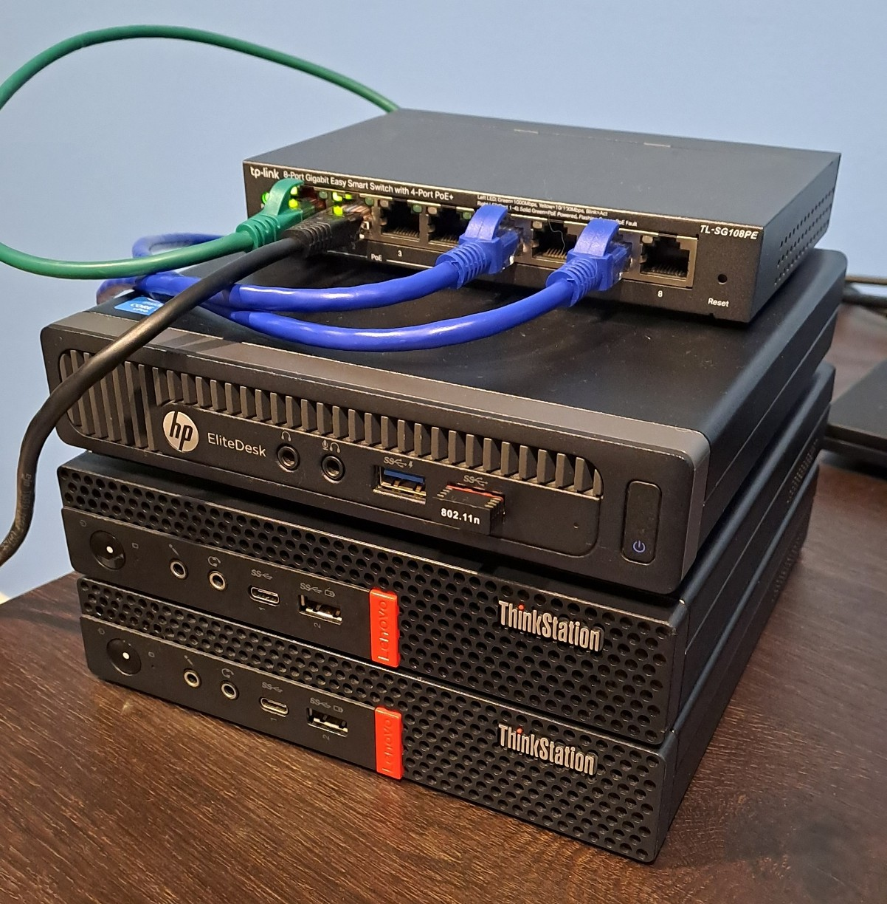

### What is Proxmox VE?

Proxmox VE (Virtual Environment) is a type-1 hypervisor that is installed directly onto a computer’s hardware (bare-metal). Proxmox VE runs a modified Debian operating system with a custom Linux kernel on bare-metal hardware. It provides the ability to create and run multiple virtual machines or containers simultaneously, making it a great choice when looking to build a virtual lab environment. 

[Official Proxmox Docs](https://www.proxmox.com/en/products/proxmox-virtual-environment/overview)

### What is a Hypervisor?

A hypervisor is a software-based layer running on top of hardware that is used to create and run multiple virtual machines (VMs) on a single host computer (or multiple nodes if clustering).

For example, a hypervisor may be running three or more virtual machines, each with a different guest operating system (OS). Each VM would be running independently, but also have the ability to communicate via virtual networking if required. Each VM has its own virtual storage, usually in the form of one or more virtual hard disk files stored on the host computer, on a NAS (network attached storage). 

#### Type 1

- Type-1 Hypervisors are "bare-metal" installations, meaning that they consist of a very lightweight host operating system dedicated to running the virtualization software.
- The benefit of using a type-1 hypervisor over a type-2 hypervisor is that it will consume very little of our limited valuable resources. 

#### Type 2

- This method involves installing an application within your main operating system that will handle the virtualization. 
- Examples of Type-2 hypervisors are Oracle Virtual Box or VMware Workstation. 
- Type-2 hypervisors are typically designed to be more user friendly and provide a great way to test out different operating systems while maintaining your favourite desktop OS.

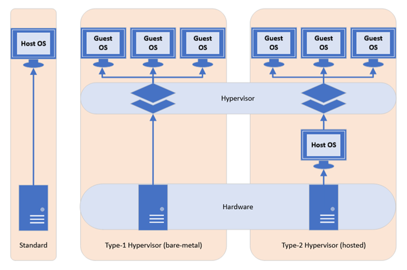

### Requirements

- USB Drive for ISO image (4GB+).
- Host machine with at least 2GB RAM and 64-bit CPU with Intel VT/AMD-V CPU flag.
- Proxmox ISO ([download here](https://www.proxmox.com/en/downloads)).
- USB Imaging Software [Rufus](https://rufus.ie/en/).
- Virtualization enabled in BIOS (AMD-V and Intel VT-x).

---

## Preparation

The process begins with preparing the USB drive with the downloaded Proxmox ISO image. For this task, I prefer to use [Rufus](https://rufus.ie/en/). Insert the USB into your computer, launch Rufus and select the Proxmox ISO file. 

- **NOTE:** When selecting the ISO image, a message may appear stating that DD image writing mode may be enforced. This is safe to ignore. Click **OK** and allow Rufus to write the image to USB.

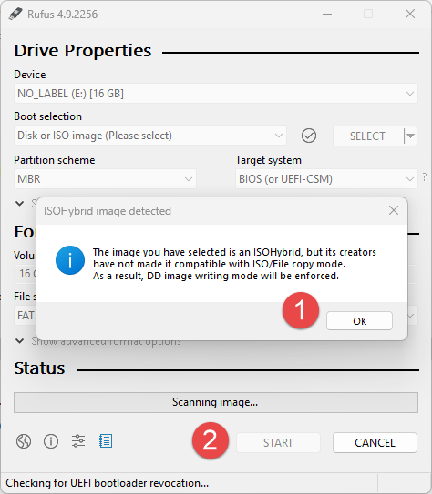

---

## Installation

Insert the USB drive into the target Proxmox node and boot from USB. If successful, the Proxmox welcome screen should be displayed. Select `Install Proxmox VE (Graphical)` and press the `Enter` key.

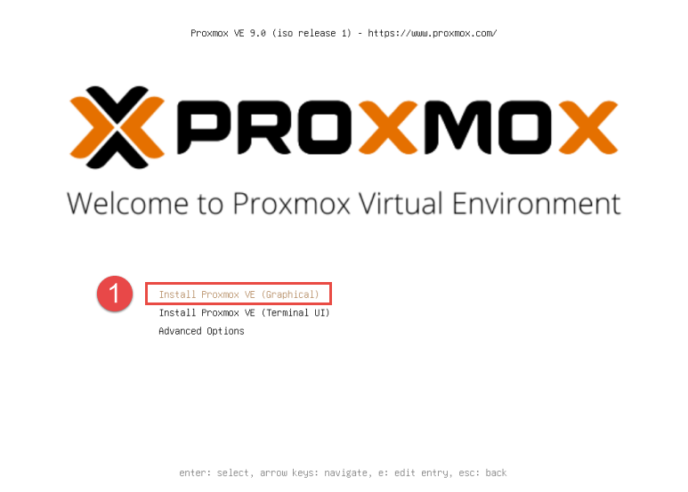

The installer will return to the terminal output as it loads. Once completed, the installer returns back to the GUI interface. Accept the EULA license agreement to proceed. 

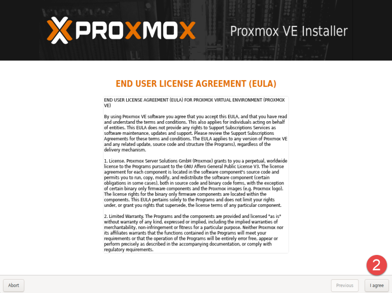

If installing on machines with more than one disk installed, select the desired installation location using the dropdown, otherwise continue with the default selected disk. 

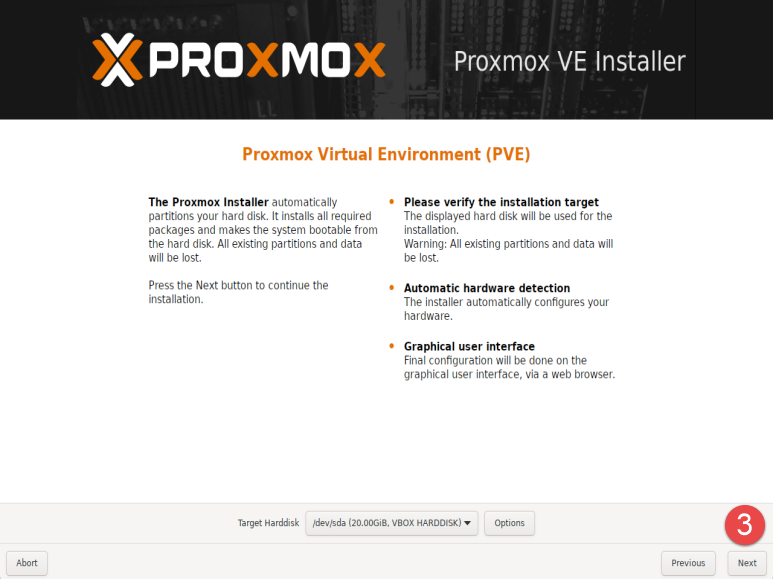

Select the desired country, time zone and keyboard layout, then click **Next**. 

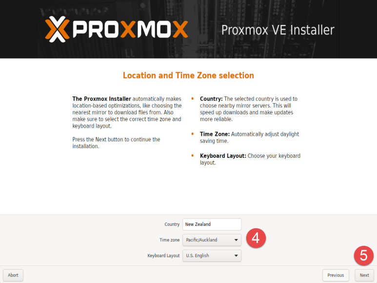

Enter a secure password for the root user. This password is used for the local root account on the host, as well as the default user account in the Proxmox web interface. Provide either a valid email address (if planning to utilize built-in mail notifications) or use a placeholder if not required. This can be changed later via the web interface. 

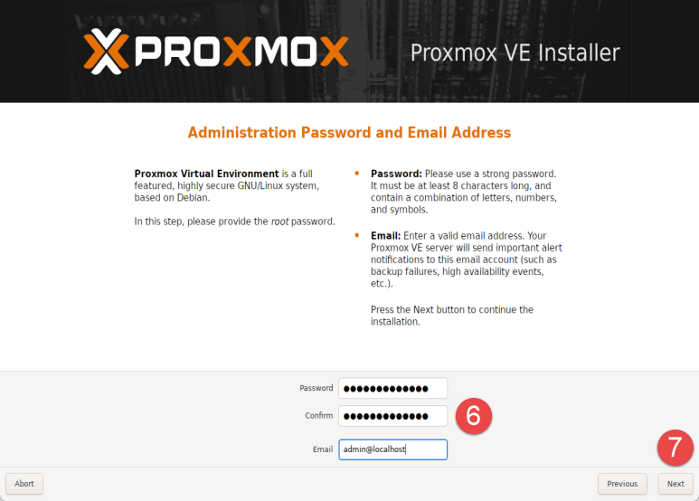

Configure the network settings as required, providing a hostname, IP address with subnet, gateway address (firewall/router), and DNS server (I'm using the same firewall/router running OPNsense for DNS). If DHCP is enabled on the firewall/router, the **Gateway** and **DNS Server** settings should have been obtained automatically, otherwise you can input these manually to suit the network. 

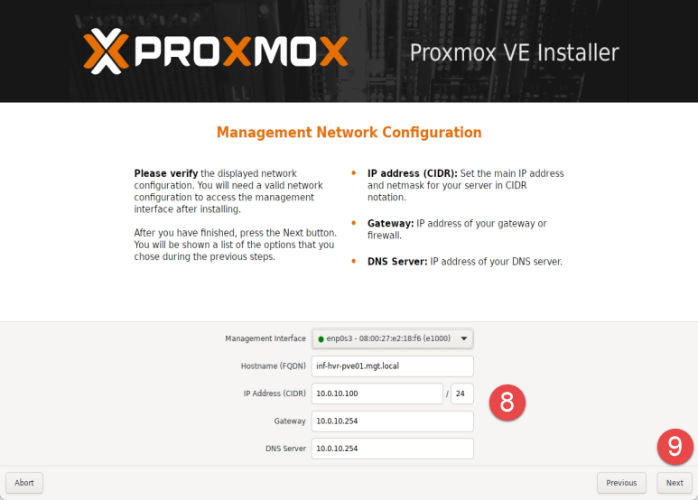

The final step provides a summary of the configuration to be applied. Ensure you have the correct settings and use the **Previous** button to backtrack and make changes if needed.

**Optional:** Untick the checkbox labelled **Automatically reboot after successful installation** to avoid booting to USB again once install has completed. Click the button labelled **Install** to being the installation process.

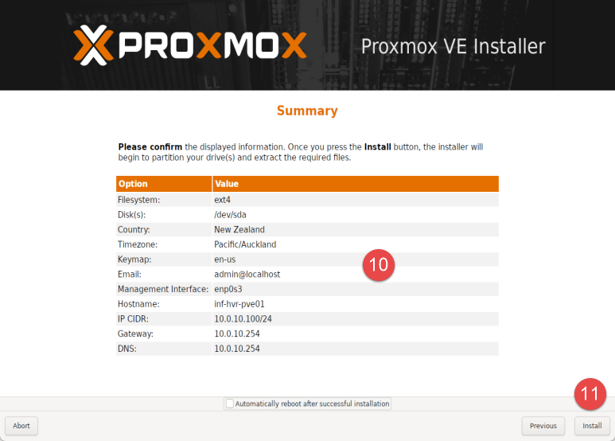

Once this process is complete, the installer will present the **Installation Successful** page.

Take note of the **IP address and port** displayed in the welcome message. This is the address for the web-based **Management Console**. You should be able to navigate to this address in a web browser from another device on the same network, such as your main computer.

Remove the USB drive from the host and click the **Reboot** button.

The login prompt presented after reboot will also provide the URL and port number for the web interface. 

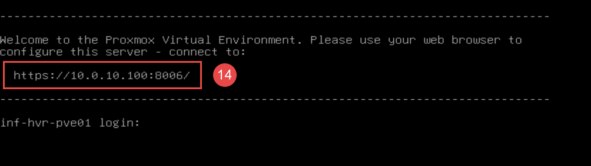

Repeat this installation on the remaining hosts, replacing the hostname and IP addressing to suit. 

---

## Web Interface Access

The management web interface is used to operate and configure the Proxmox system. Using another computer on the same network, open a web browser and navigate to the address provided in the previous installation step.

- **NOTE:** You may encounter a warning message advising of a potential risk. This is due to the Proxmox server using a self-signed certificate rather than one provided by an official certificate authority. As you are the owner of this server, it is safe to proceed. Click **Accept the Risk and Continue**.

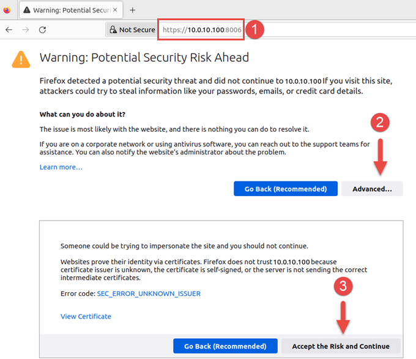

The Proxmox web interface will load and present a login prompt. Use the **root account** and the password configured during the installation phase.

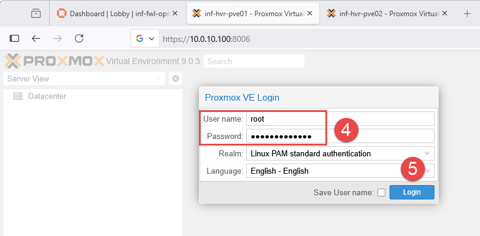

- **Note:** After login, you may be presented with a message stating that you do not have a valid subscription for the server. As Proxmox VE is available for free, Proxmox offer additional licensing or [subscriptions](https://www.proxmox.com/en/products/proxmox-virtual-environment/pricing) for extra features, services and support. Click **OK** to proceed.

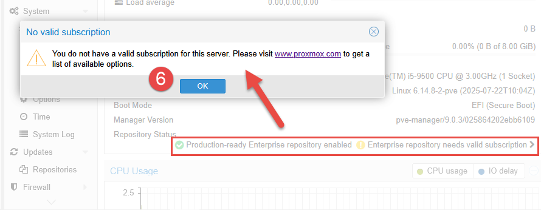

---

## Post-Install Configuration

This section will focus on the initial configuration post-install. If using a single-node design (only one Proxmox node), some content in this section may not be relevant as the a number of steps are aimed at multi-node environments. 

### Disable Enterprise Repositories

To avoid errors when performing updates, disable the **Enterprise** repositories. Operating system updates for Debian will still be made available for install, however Proxmox specific updates will not be available (unless a subscription is purchased). 

1. Select the Proxmox node from the left-side panel and navigate to `Updates > Repositories`.
2. Select each of the **Enterprise** repositories, then click **Disable**. 

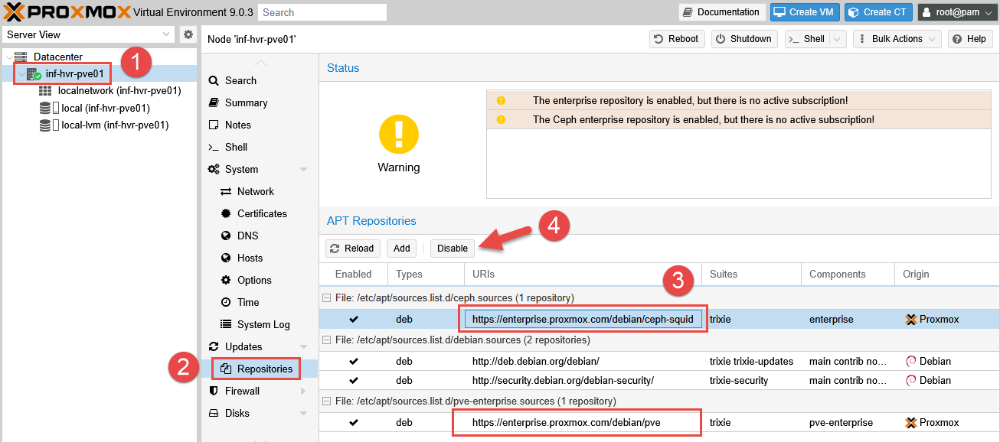

### Install Updates 

To check for and install system updates, click the button labelled `Shell` from the top navigation panel. This provides a shell terminal for the Proxmox node. Run the command below to update the repositories and install any pending updates. Close the shell when complete. 

```bash
# Update repository cache and upgrade packages.
apt update && apt upgrade -y
```

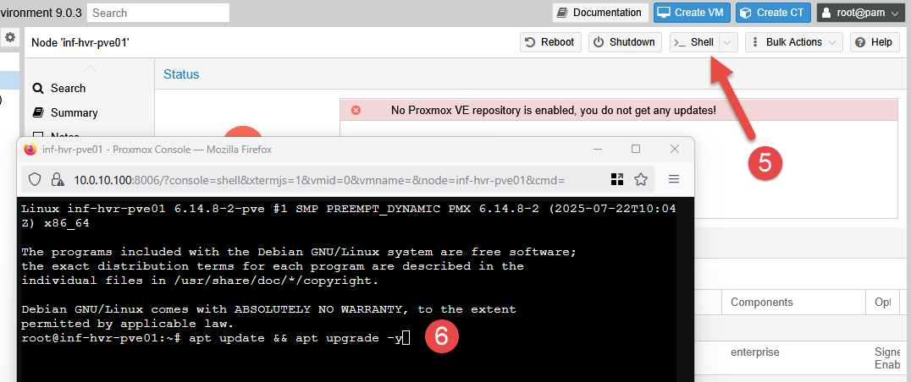

### Remove 'No Valid Subscription' Message

This message will appear in the web interface at the beginning of each logon session unless a subscription is purchased, or code changes are made to to remove it. 

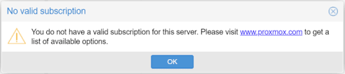

To remove the message popup, open a shell session using the **Shell** button in the top navigation panel from within the Proxmox web interface. Locate and edit the file responsible for displaying this message.

```bash
# Backup the javascript file BEFORE making changes.
cd /usr/share/javascript/proxmox-widget-toolkit
cp proxmoxlib.js proxmoxlib.js.backup

# Edit the file using nano.
nano proxmoxlib.js
```

Locate the section containing the text "No valid subscription" using the `CTRL + F` key combination. Edit the line containing "Ext.Msg.Show" as per the below.

```
# Original:
Ext.Msg.show({
    title: gettext('No valid subscription'),

# Updated:
void({ //Ext.Msg.show({
    title: gettext('No valid subscription'),
```

Save the changes and exit nano using the key combinations `CTRL + O` and `CTRL + X`. Restart the Proxmox web service. Note that this will kill the terminal/shell session. 

```bash
# Restart the Proxmox web service.
systemctl restart pveproxy.service
```

Repeat these steps for each Proxmox node. Clear your browser cache, or force a full page reload (`CTRL + F5`) for some browsers. Log back into Proxmox and confirm the message is no longer displayed. 

### Optional: Configure Port-Forwarding for External Access

This section provides the configuration needed to allow access to the Proxmox nodes from outside the lab network. This can be useful for situations where access is required from a device located on the WAN side. For example, when you want to manage the infrastructure, but are not connected to the internal LAN network. 

- **NOTE:** This method is **not recommended** if the WAN side of the firewall is internet-facing. As the firewall in my lab environment is sitting within my main home network, the risk is minimized and restricted by using rules to only allow traffic from my laptop. 

From within the **OPNsense** web management interface, select `Firewall > NAT > Port Forward`. Click the plus icon to create a new port-forwarding rule. 

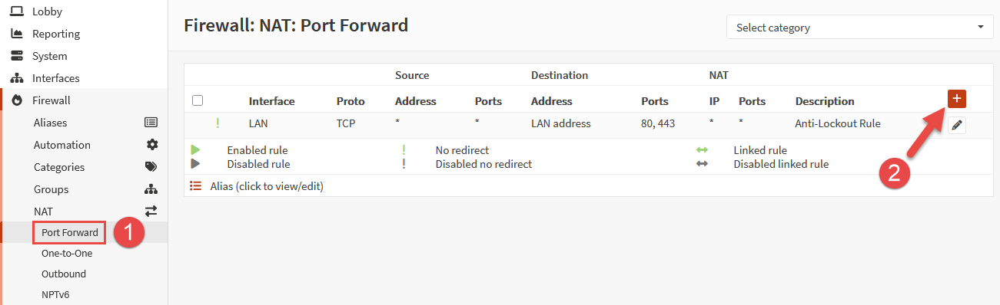

Configure the rule as follows, then click **Save**:

- **Interface:** WAN
- **TCP/IP Version:** IPv4
- **Protocol:** TCP
- **Source:** Single Host or Network (click Advanced to display)
- **Source IP:** 10.0.0.150/32 (replace with your own computer IP)
- **Source Port Range:** Any (source ports are usually dynamic)
- **Destination:** This Firewall
- **Destination Port Range:** 8000 (desired external port)
- **Redirect Target IP:** 10.0.10.100 (replace with your own Proxmox node IP)
- **Redirect Target Port:** 8006 (default Proxmox web port)
- **Log:** Enabled (optional)
- **Description:** WAN_PF_HTTPS_Proxmox-01 (or use another descriptive name)

Once returned to the rule table, click the button **Apply Changes**. Repeat this process for any remaining Proxmox nodes that you wish to externally manage.

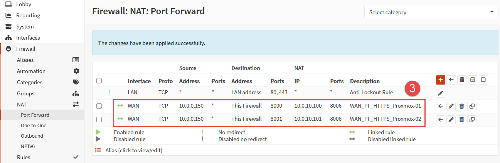

You should now be able to access the Proxmox web portal from your device, connected to the external (WAN) network - in my case, home wireless network using the IP address of the firewall and the chosen port as the suffix. 

**Example:** `https://10.0.0.250:8000`

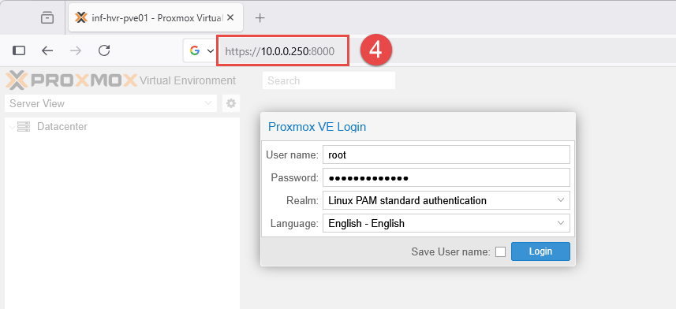

---

## Next Steps

This concludes the guide for the initial installation and setup for Proxmox in the home lab. For more details or guidance on working with Proxmox, see the [vendor supplied documentation](https://pve.proxmox.com/pve-docs/chapter-sysadmin.html). 

The next part in the series will provide the steps required to configure the first virtual machine (VM) on a Proxmox node.

---

_Cover photo by <a href="https://unsplash.com/@kevinache?utm_content=creditCopyText&utm_medium=referral&utm_source=unsplash">Kevin Ache</a> on <a href="https://unsplash.com/photos/a-rack-of-servers-in-a-server-room-2JJ3wBHu4_0?utm_content=creditCopyText&utm_medium=referral&utm_source=unsplash">Unsplash</a>_