## Overview

In this section, we will cover the basic steps required to provision a virtual machine (VM) running Ubuntu Server in Proxmox. This can be achieved in either a **single or multi node** Proxmox environment, and does not require a cluster to be configured. 

### Requirements

- An installed and configured Proxmox node.
- Internet access from either the Proxmox, or local computer with access to Proxmox.
- Downloaded [Ubuntu ISO file](https://ubuntu.com/server).
- Optional: Configured VLAN in firewall/OPNsense.

### Hardware Update (Informational)

In preparation for joining the Proxmox nodes to a cluster, USB ethernet adapters have been added to each node to be used as dedicated virtual machine networks/VLANs. This will allow for keeping the onboard NIC dedicated to the Proxmox node traffic only, reducing "noise" within the network. 

Although USB ethernet adapters are not _generally_ considered suitable for heavy or production purposes due to flaky reliability, they will suffice until PCI-E network adapters that fit in the small P330 can be sourced. 

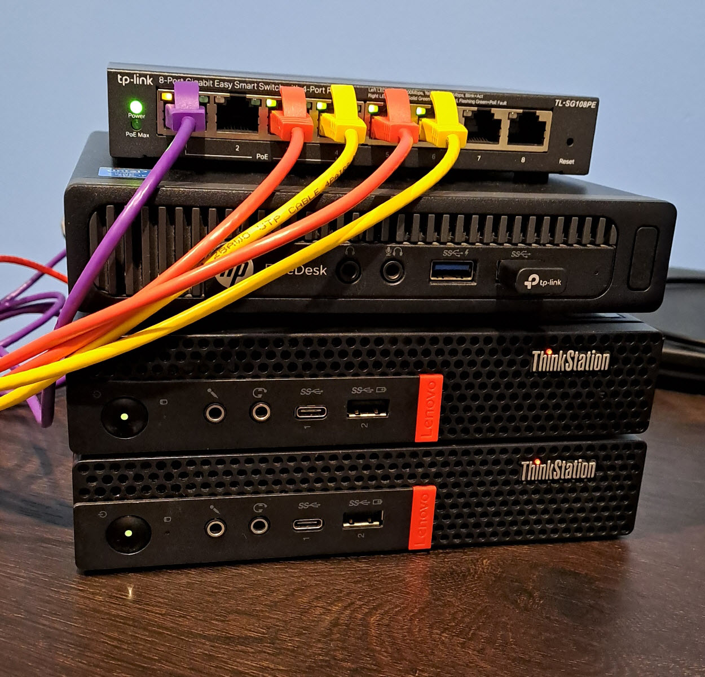

---

## Upload/Download VM Operating System

This step can be achieved by several methods. The target operating system for your VM can be downloaded outside of Proxmox (local machine) and uploaded to the node via the web interface, or can be downloaded from the Proxmox web interface itself. 

1. Login to the Proxmox web interface, select **local** storage from the left side navigation panel, then select **ISO Images**. 
2. Select either **Upload** or **Download from URL**.
3. Select either an **ISO** file previously downloaded , or enter the **URL** path for an ISO download. 
4. Depending on your method, click either the **Upload** or **Download** button.

**Option 1: Pre-Downloaded ISO**  

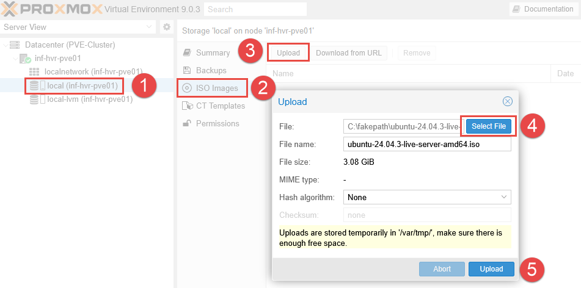

**Option 2: Download via URL**  

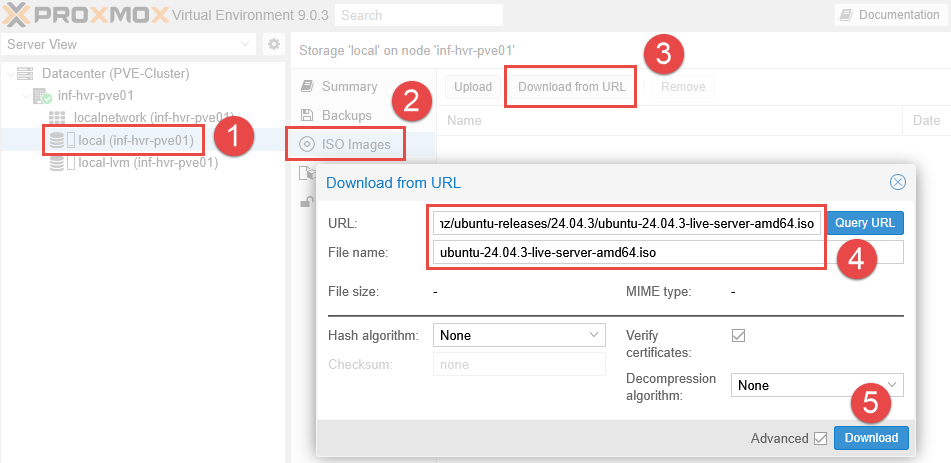

Once the upload (or download) has completed, the OS image should now be listed under **ISO Images**. 

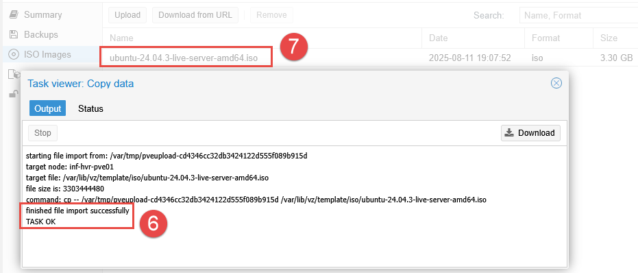

---

## Optional: Configure VM Network/VLAN

This step ensures that VMs will use their own network/VLAN, separate form the Proxmox node network which is used primarily for cluster traffic. 

- **NOTE:** If your Proxmox node has only a **single NIC**, or you are **not using VLANs**, some content in this section may not apply. The default network connection (vmbr0) can be used instead, however is usually reserved for use as a dedicated Proxmox node network. This example uses an _existing_ VLAN configured in an OPNsense firewall/router.

1. Select the Proxmox node and navigate to the **System > Network** menu. 
2. Depending on your setup, you may see either one or more items labelled **Network Device**. These are physical network adapters. In this example, the device `eno1` represents the onboard ethernet network adapter, with `enx00e04c424a99` being an additional USB ethernet adapter. 

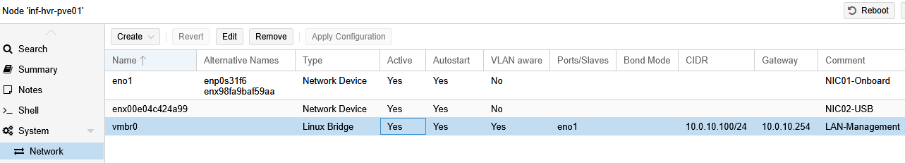

3. The **Linux Bridge** acts as a virtual switch, connecting virtual machines (VMs) to the physical network, while a network device (like a physical network card or a bond of multiple network cards) is the actual hardware interface.
4. Click the **Create** dropdown button and select **Linux Bridge**. 
5. Enable **Autostart** and **VLAN aware** options for the connection. 
6. Bridge the new connection to the USB ethernet adapter under the **Bridge Ports** field. 
7. Add a meaningful comment along with the accepted VLAN IDs matching that in OPNsense. 

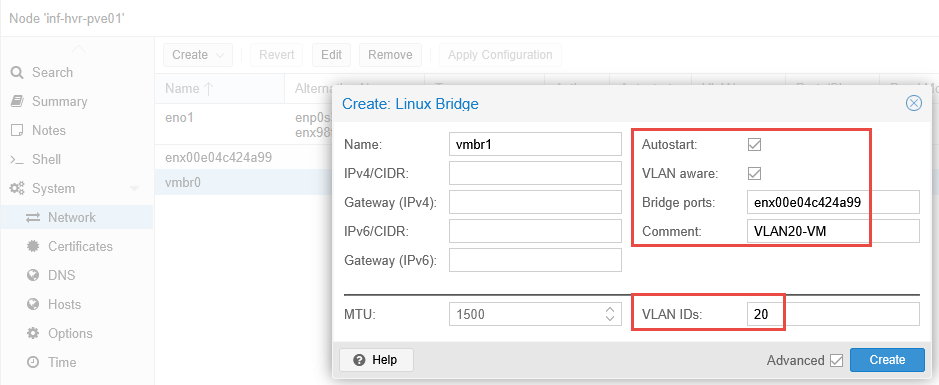

If **DHCP** is enabled for the OPNsense VLAN20, the new VM should receive an IP address once it has booted. 

---

## Create Virtual Machine (VM)

With the OS image file now available on the Proxmox node, we can proceed with creating the VM. 

1. From the Proxmox web interface, select the Proxmox node and right-click to display a menu.
2. Select the option **Create VM** - alternatively click the **Create VM** button from the top navigation panel. 

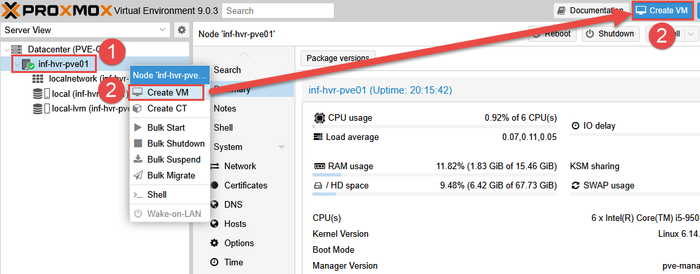

3. Select the Proxmox node where this VM will be located. 
4. Leaving the ID as the provided default, provide the VM with a name. 
5. Using the **Advanced** tick box will allow more further configuration if required. 
6. Click **Next**. 

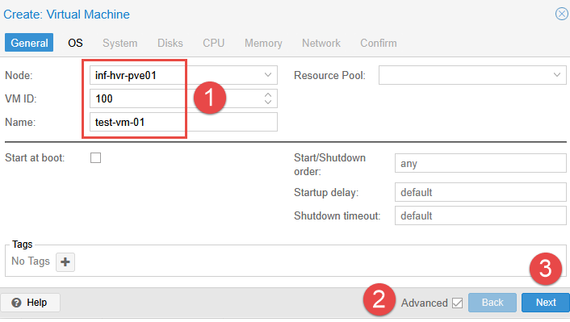

7. On the **OS** settings tab, select the ISO file downloaded previously and click **Next**.

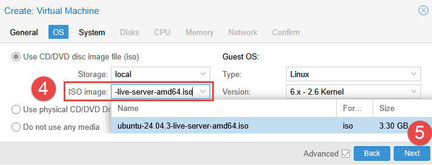

8. On the **System** settings tab, make any changes that may be recommended for your chosen OS and click **Next** to continue. 

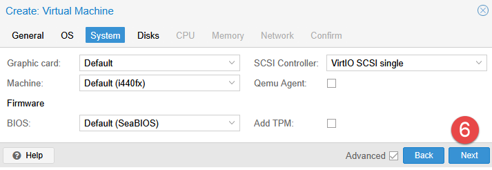

9. Define the desired disk size, adding any additional disks if required. 
10. By default, the option for **Backup** is enabled, disable this option if not necessary.
11. Click **Next**.

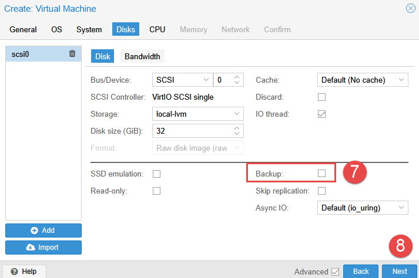

12. Set the desired number of CPU sockets and cores to be recognized by the VM. Note that this option provides _access_ to the number of host cores, and is the number the guest OS will see. It does not "dedicate" the cores to the VM exclusively. 
13. Setting the **CPU Type** to "host" allows the VM to access the CPU features made available by the processor installed in the Proxmox node. 

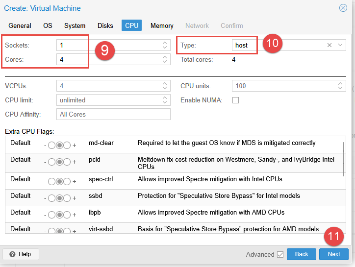

14. Specify the required amount of memory (RAM). Unlike CPU, this assignment _does_ allocate the entire amount specified to the VM (unless ballooning is enabled and river installed).
15. Optional: The **Ballooning Device** option will allow Proxmox to reclaim unused memory from idle VMs and reallocate it to other VMs or the host system when needed. This requires additional drivers installed in the guest VM operating system. 
16. Click **Next**. 

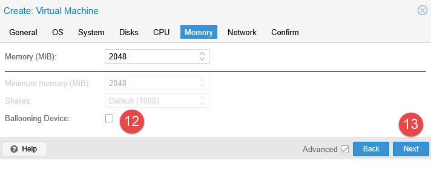

17. If the previous section was skipped, select the default network bridge available - otherwise select the newly created bridge, along with the VLAN tag ID. 
18. Click **Next**.

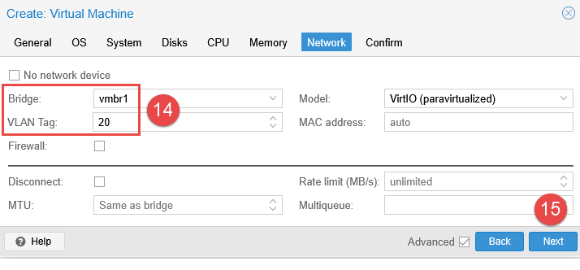

17. Review the configuration on the final screen. Click **Finish** to create the VM.

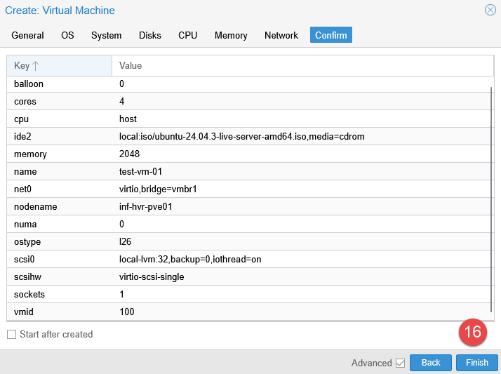

---

## Testing the VM

With the VM now created, power it on to test the configuration and boot into the ISO image. 

1. Right click the VM listed in the left side navigation panel. 
2. Click **Start**. 

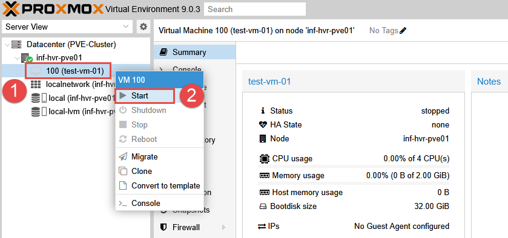

3. When the VM is booted up, proceed through to the installer to confirm that the virtual NIC attached to the VM received an IP address from DHCP. 
4. If the VM does not receive an IP address, check the setting on your firewall to confirm that service is enabled for providing addressing on the interface (either VLAN or LAN). 

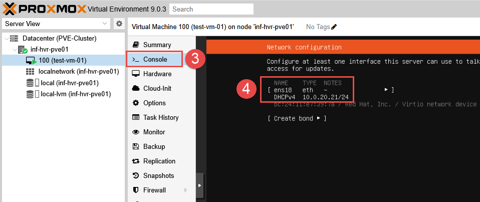

---

## Next Steps

This concludes the guide for setting up the first VM in Proxmox. The next part in the series will provide the steps required to configure **clustering**, allowing for centralized management of the Proxmox nodes, and further capabilities such as high availability and replication. 

---

_Cover photo by <a href="https://unsplash.com/@theoneandonlydantaylor?utm_content=creditCopyText&utm_medium=referral&utm_source=unsplash">Dan Taylor</a> on <a href="https://unsplash.com/photos/a-wall-of-electronic-equipment-in-a-dark-room-5-0L-kJGQmE?utm_content=creditCopyText&utm_medium=referral&utm_source=unsplash">Unsplash</a>_