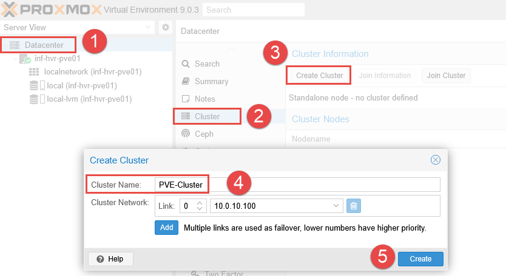
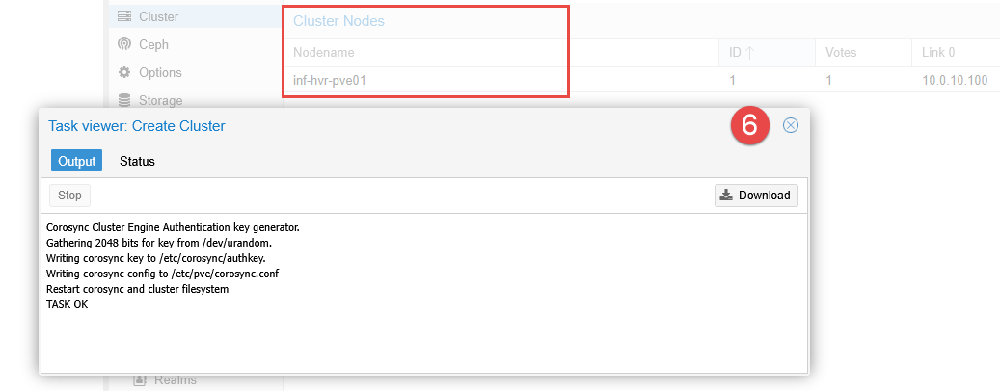
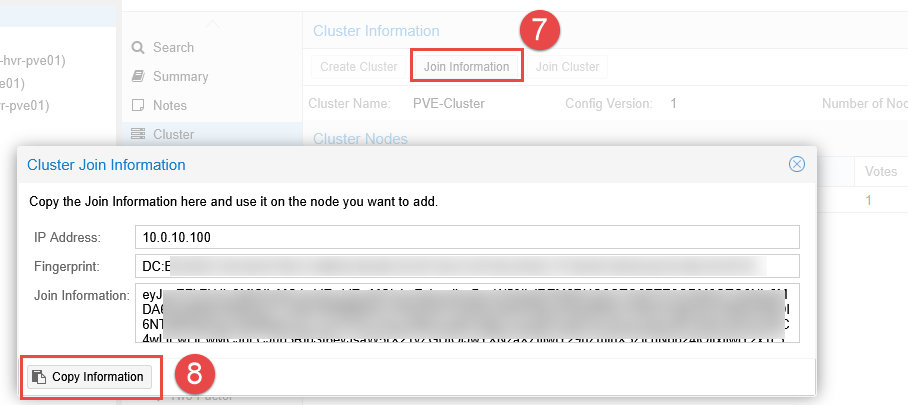
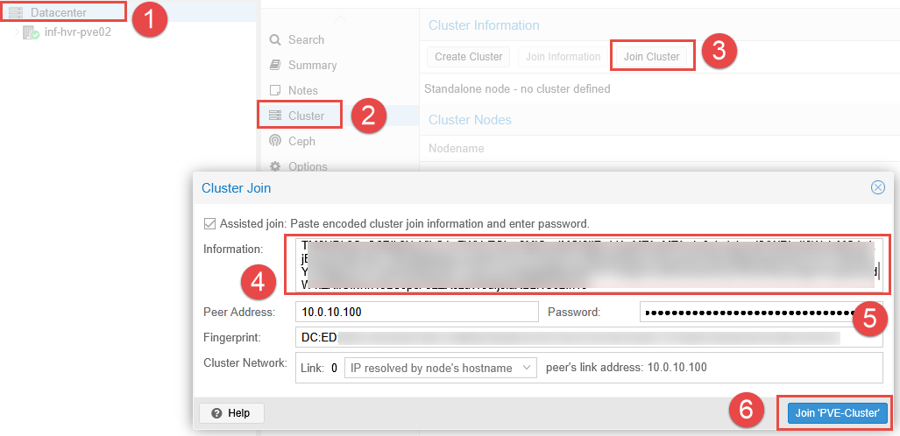
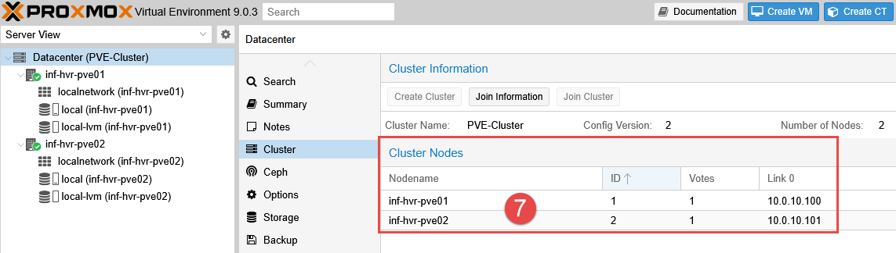
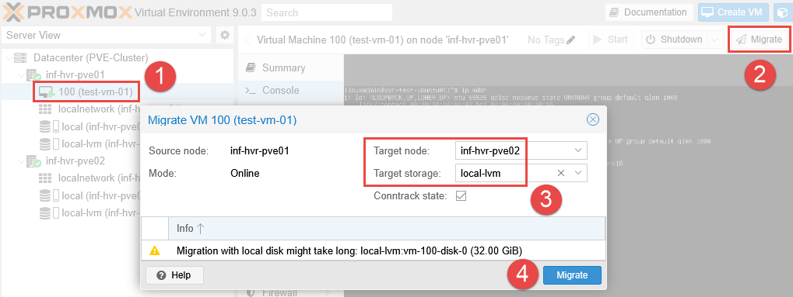
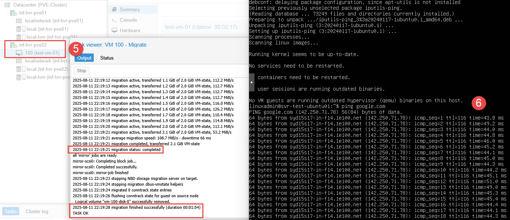

## Overview

Adding individual Proxmox nodes into a cluster allows for a centralized web management portal, removing the need to access each nodes web portal separately. Joining the cluster also allows for replicated configuration, making management of the nodes and the environment simpler. Virtual machines can be migrated between nodes, which is useful for maintenance windows and providing High Availability functionality, which will be covered in a later guide.

- **NOTE:** A minimum of 3 Proxmox nodes is _typically_ required in order to maintain **quorum**. However, using a **Qdevice** allows for a **two-node cluster** to operate and maintain quorum, without the need of an entire third Proxmox node. It should be noted that it is possible to have a two-node cluster without a Qdevice providing quorum. This still allow for centralized management and manual migration tasks. 

_**The topic of Qdevice configuration will be covered in a later guide.**_

### Requirements

- Two Proxmox nodes (or more) installed and initial configuration completed. 
- Network connectivity between the nodes. 

---

## Configuring the Proxmox Cluster

The first step to configure the Proxmox cluster is to ensure we have access to the web management console for both Proxmox nodes. Although this configuration can be achieved via the terminal on each node, we are going to use the GUI to provide a visual representation of how this all hangs together. 

### Create the Cluster (First Node)

1. Starting with the first Proxmox node in the environment, navigate to the web interface, login and select **Datacenter** from the left side navigation panel. 
2. Within this section, select **Cluster**, then click the button **Create Cluster**.
3. Provide a name for the cluster and click **Create**.

4. You should see an output message with the text `TASK OK` once the cluster has been successfully created. 
5. The Proxmox node should now also be listed under the section **Cluster Nodes**. 

5. Click the button **Join Information** and click the button **Copy Information**. This will be used to join the second Proxmox node to join the cluster that has just been created. 

### Join the Cluster (Second Node)

1. In another browser window, navigate to the web interface for the second Proxmox node. 
2. Login and navigate to the **Datacenter** section, select **Cluster** and click **Join Cluster**. 
3. Paste the copied data from the first Proxmox node into the **Information** field. 
4. Enter the root password for the first Proxmox node and click **Join Cluster**. 

Once complete, you should now see **both** Proxmox nodes listed under the **Cluster Nodes** section, along with the nodes listed in the left side navigation panel. 

Joining the cluster will allow each node to be configured from the web interface of the other node, and visa versa. 

---

## Live VM Migration

The ability to migrate VMs between Proxmox nodes is a functionality provided when using Proxmox nodes in a cluster. This can be useful during planned maintenance windows or when a specific Proxmox nodes resources are nearing capacity. 

- **NOTE:** Live migration is only possible if both the source and target nodes are active and online. 

Using live (online) migration allows for the VM to remain active while it is migrated from the first Proxmox node to the second node. The migration will include storage along with CPU and memory state. 

1. Right click the VM and select **Migrate** (alternatively use the **Migrate** button from the top navigation panel).
2. Select the target node to migrate the VM, and select the an available storage option. 
3. Enable the option for **Contrack State** if using the built-in Proxmox firewall. This will help maintain network connections during the migration process. 
4. Click **Migrate** to begin the live migration from node 1 to node 2. 

5. **Optional:** Run a continuous ping test during the migration to demonstrate the VM is remaining active during the process. 

6. Once complete, you will see the VM listed under the second node in the navigation tree in the left side panel. 

---

## Next Steps

This concludes the steps required to configure clustering for Proxmox in the home lab, showing the benefits of a live migration for VMs within a cluster. The next part in this series will provide the steps required to configure a **Qdevice** for maintaining quorum within the Proxmox cluster. 

---

_Cover photo by <a href="https://unsplash.com/@freeche?utm_content=creditCopyText&utm_medium=referral&utm_source=unsplash">Kvistholt Photography</a> on <a href="https://unsplash.com/photos/photo-of-computer-cables-oZPwn40zCK4?utm_content=creditCopyText&utm_medium=referral&utm_source=unsplash">Unsplash</a>_