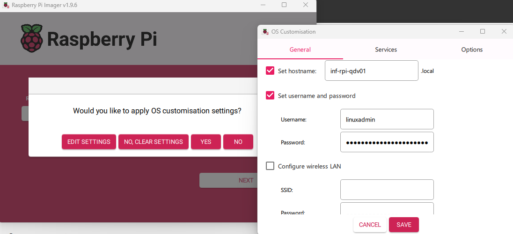
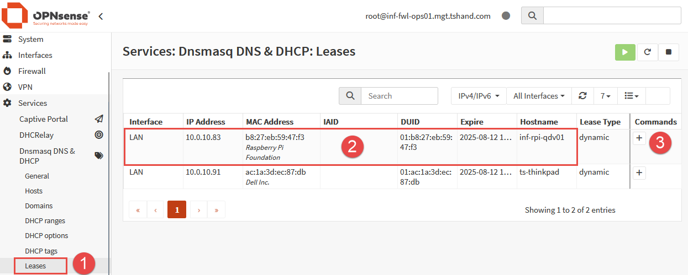
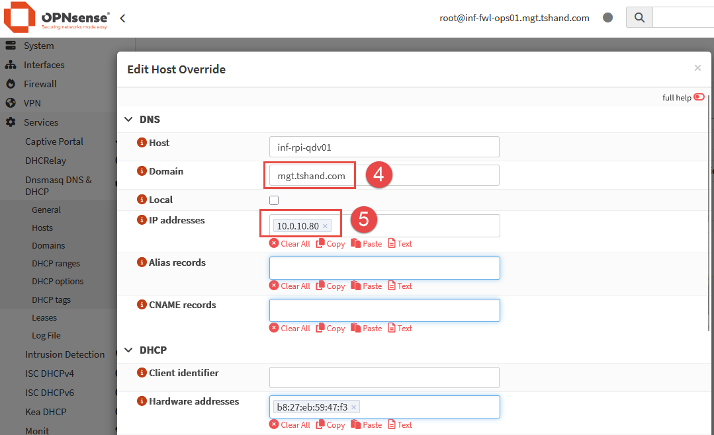
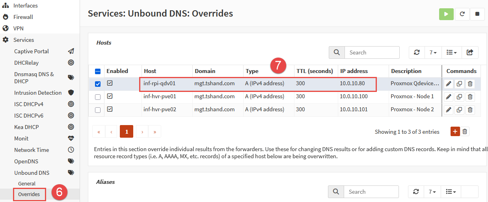
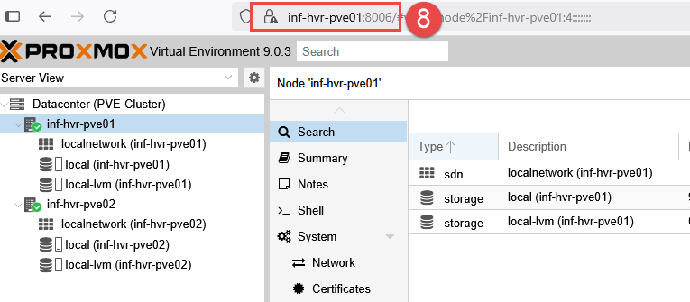
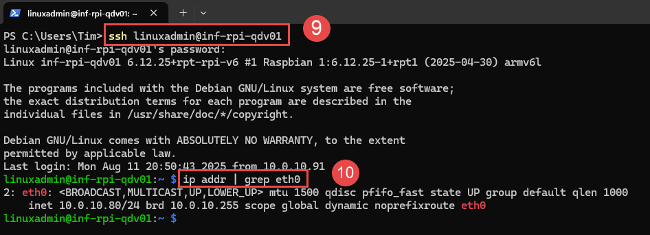
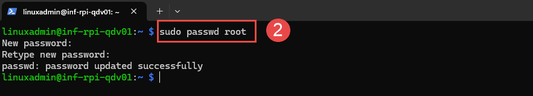
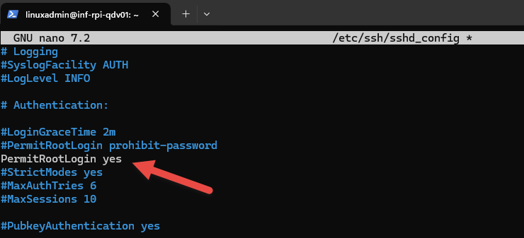
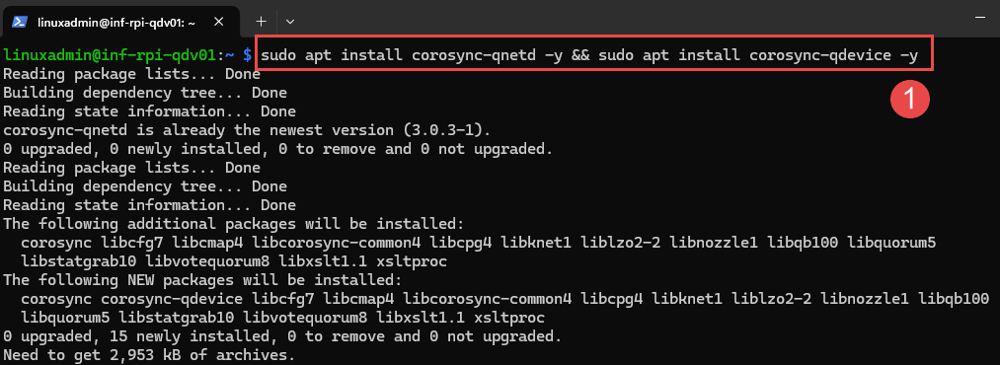
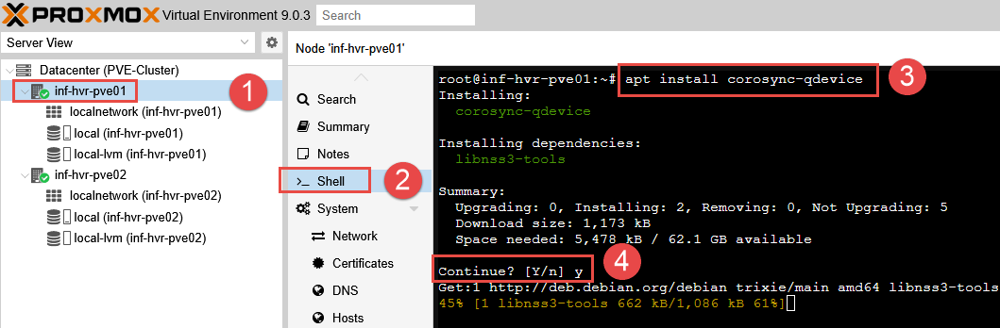

## Overview

This article explains the steps required to configure a **Qdevice** within a Proxmox cluster. Typically, a minimum of 3 Proxmox nodes is required in order to maintain **quorum**. However, using a **Qdevice** allows for a two-node cluster to operate and maintain quorum, without the need of an entire third Proxmox node.

- **NOTE:** This guide is intended for clustered environments with **less than three Proxmox nodes**, or environments with an **even number of nodes** where voting can result in a 50/50 situation. If your environment contains three or more Proxmox nodes, configuring a Qdevice is not required 

### What is Quorum?

Quorum refers to the minimum number of Proxmox nodes that must be online and communicating for the cluster to operate safely and make decisions using a **voting system**. A cluster requires more than **half** of its nodes to be online and connected to achieve quorum. This usually requires at least three nodes total, or a higher odd number of nodes. 

Proxmox uses [Corosync](https://corosync.github.io/corosync/) for communication between nodes in a cluster, and quorum is used to avoid _split-brain_ scenarios, where two nodes of a cluster may try to manage the same resources independently, potentially corrupting the data.

### The Qdevice Solution

The [Corosync QDevice](https://pve.proxmox.com/pve-docs/chapter-pvecm.html#_corosync_external_vote_support) is a service that runs on each Proxmox node, as well as on an **additional** device (server, raspberry pi etc), which is able to act as a "voting member" within the cluster. For this lab environment, an old Raspberry Pi will be used to provide this service. The **Raspberry Pi** will be connected to the LAN network where the Proxmox nodes are located. 

### Requirements

- An existing Proxmox cluster.
- Download the [Raspberry Pi Imager Tool](https://www.raspberrypi.com/software/). 
- SD Card to be used with Raspberry Pi.
- Additional Ethernet cable to connect RPi to the LAN/Management network.
- Chosen Qdevice **must** be running a Debian operating system.

---

## Raspberry Pi Preparation

This section describes the steps required to configure a **Raspberry Pi** for use as a **Qdevice** to provide quorum to the Proxmox cluster. Although a Raspberry Pi is chosen for this specific task due to it's small footprint, other options are available as replacements. 

### Write OS Image to SD Card

1. Remove the SD card from the Raspberry Pi and insert into a computer with an available card slot. A USB Card Reader can be used for devices with no built-in SD card slot. 
2. Run the **Raspberry Pi Imager** application and select the desired **Operating System** to suit your device model. I opted for the **Lite** (headless) version, omitting the Desktop environment to reduce resource consumption. 
3. Select the SD card as the **Storage** method. 
4. An option is available to pre-configure the hostname, default credentials, WiFi network and locate settings if desired. I chose to configure these settings, including **enabling SSH** with password authentication under the **Services** tab. 
5. Click **Next** to begin writing the OS to the SD card.



### Optional: DHCP & DNS Configuration (OPNsense)

**NOTE:** This section is only applicable when using **OPNsense** for firewalling, routing and DHCP/DNS services. Skip this section if not required. 

With the RPi connected to the LAN and powered on, I confirmed that it has received an IP address via DHCP in OPNsense. Clicking on the plus icon under the **Command** column allows for setting this device to use a DHCP reservation, rather than receiving a random address from the DHCP pool. 




Entries for both the Qdevice and the existing Proxmox nodes can be added to **DNS (Unbound)** for name to IP address resolution. This will allow for us to utilize **hostnames** when connecting via HTTPS or SSH. 




Reboot the RPi to allow it to receive the new IP address from the DHCP reservation. Once back online, confirm that SSH is available to the RPi device on the newly assigned IP address. 

```bash
# SSH to the Raspberry Pi using hostname and user provided during install.
ssh linuxadmin@inf-rpi-qdv01

# List assigned IP address for eth0 interface.
ip addr | grep eth0
```



---

## Qdevice Installation & Setup

### Root Account SSH

A requirement for the Qdevice daemon (service) is the ability to SSH into the Qdevice (Raspberry Pi) as the root user account. 

- **NOTE:** This is _not ideal_ in terms of security, and not recommended in typical scenarios. However, after the initial setup of the Qdevice, **firewall rules** will be configured in OPNsense to block ingress and egress traffic to this device, other than from the Proxmox nodes, adding a layer of security. 

1. Reset the root user account password. 

```bash
# Reset root account password.
sudo passwd root
```



2. SSH into the Raspberry Pi (RPi) device using the account created during the installation and SD card imaging process. 
3. Edit the SSH config file `/etc/ssh/sshd_config` using `nano` or `vi` text editors. 

```bash
# Edit SSH config file.
sudo nano /etc/ssh/sshd_config
```

4. Locate the text `PermitRootLogon` and set the value to `yes`.

```
PermitRootLogin yes
```



5. Write the changes  (`CTRL + O`), then exit the nano text editor (`CTRL + X`). 
6. Restart the `sshd` service. 

```bash
# Restart the SSHD service. 
sudo systemctl restart sshd
```

### Package Installation

**Packages to be installed:**
- **Proxmox Nodes**:
	- corosync-qdevice
- **Qdevice:**
	- corosync-qnetd
	- corosync-qdevice

1. SSH into the Raspberry Pi device update the install packages, then install the `corosync-qnetd` package. 
2. You may be prompted to install some other dependency packages, enter `y` and press `Enter`. 

```bash
# Update repo list and upgrade installed packages.
sudo apt update && sudo apt upgrade -y

# Install corosync-qnetd package.
sudo apt install corosync-qnetd -y && sudo apt install corosync-qdevice -y
```



---

## Proxmox Node Configuration

With the Raspberry Pi device now configured, both Proxmox nodes need to be setup to work with the Qdevice. 

1. Login to each Proxmox node (either by SSH or web interface). 
2. Within a shell (terminal) window, install the `corosync-qdevice` package. 
3. Repeat this step for both Proxmox nodes, so the package is installed on both.

```bash
# Install the Qdevice package. 
apt install corosync-qdevice
```



4. Select a Proxmox node (this step is only required on one node) and access the terminal.
5. Configure the Qdevice connection by running the `pvecm` command.

```bash
# Configure Qdevice connection.
# Example: pvecm qdevice setup [IP ADDRESS]
pvecm qdevice setup 10.0.10.80
```

6. Enter the Raspberry Pi root user account password when prompted. 
7. The Qdevice should now be added to the cluster as a voting member. 
8. Verify using command `pvecm status`, noting the "QDevice" listed under **Membership Information**. 
9. You should now see the entry for 'Qdevice' listed.

```bash
Votequorum information
----------------------
Expected votes:   3
Highest expected: 3
Total votes:      3
Quorum:           2  
Flags:            Quorate Qdevice 

Membership information
----------------------
    Nodeid      Votes    Qdevice Name
0x00000001          1    A,V,NMW 10.0.10.100 (local)
0x00000002          1    A,V,NMW 10.0.10.101
0x00000000          1            Qdevice
```

With the Qdevice now added to the cluster to provide/maintain quorum, if a Proxmox node goes down, the cluster will still be able to function with the Qdevice providing the required vote to maintain cluster quorum. 

---

## Next Steps

This concludes the steps required to configure a Qdevice used to maintain quorum for Proxmox. The next part in the series will provide the steps required to configure a ZFS storage pool in the Proxmox datacenter, useful when the option for shared storage is not available.

---

_Cover photo by <a href="https://unsplash.com/@jainath?utm_content=creditCopyText&utm_medium=referral&utm_source=unsplash">Jainath Ponnala</a> on <a href="https://unsplash.com/photos/black-and-blue-usb-cable-9wWX_jwDHeM?utm_content=creditCopyText&utm_medium=referral&utm_source=unsplash">Unsplash</a>_