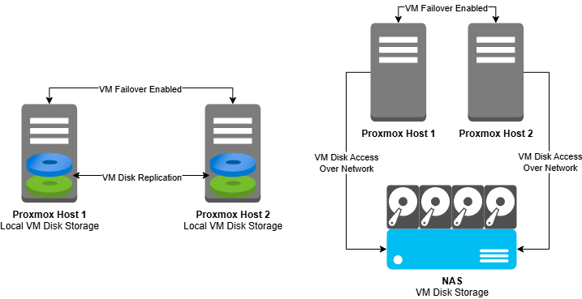
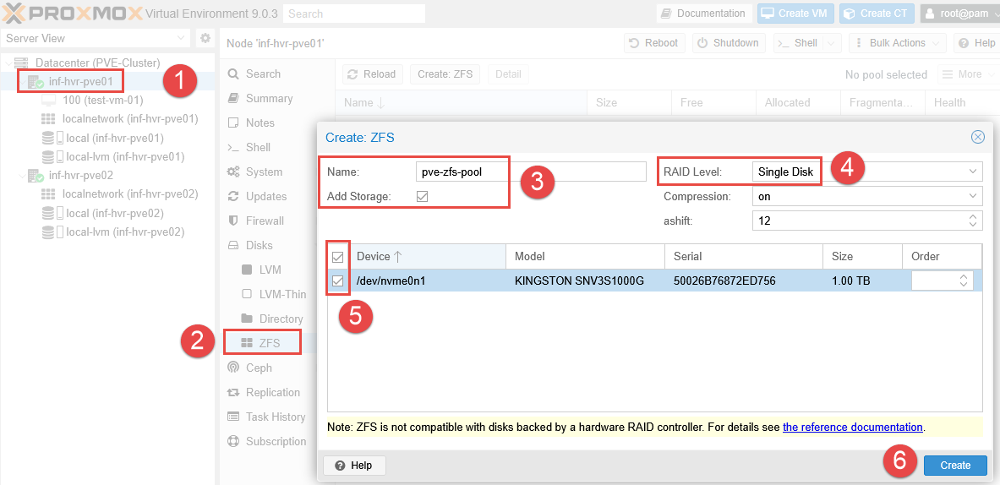
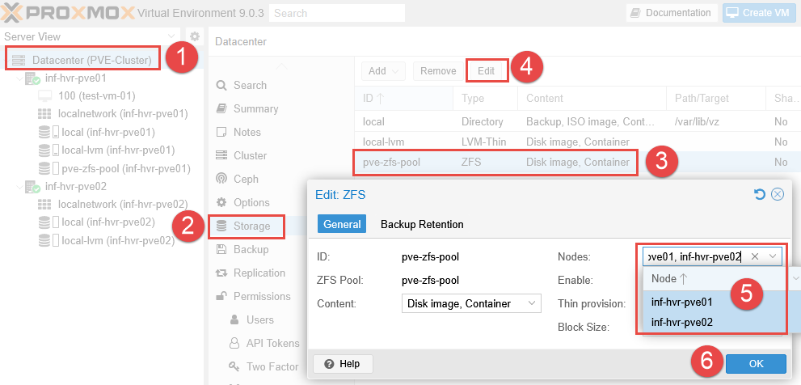
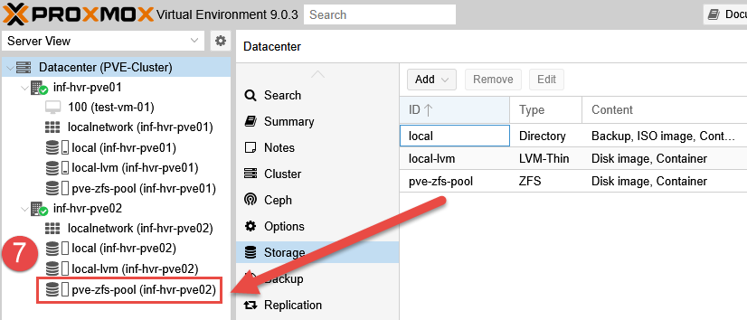
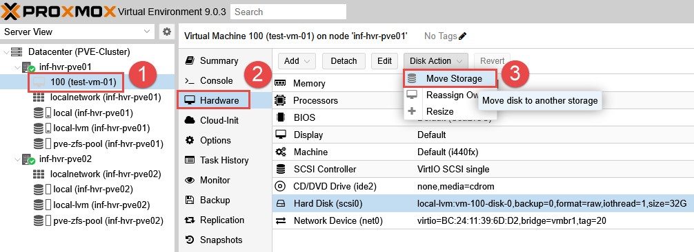
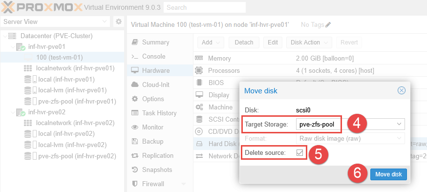
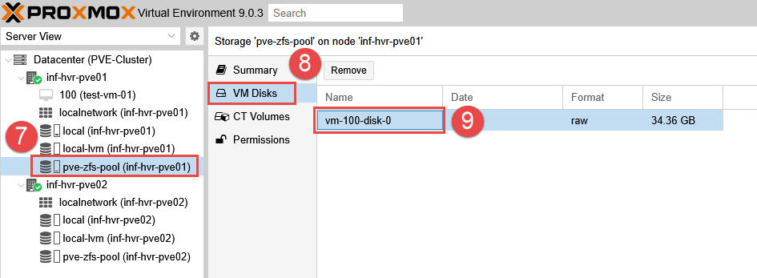
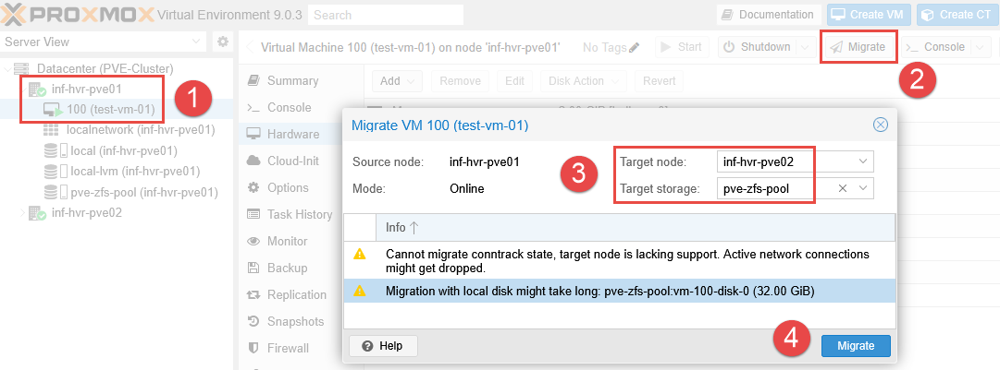
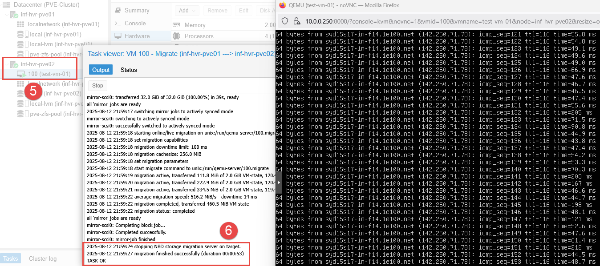
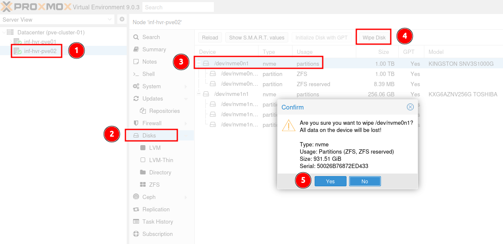

## Overview

This article covers the topic of storage within Proxmox, and how to configure a ZFS pool within a clustered datacenter. This ZFS pool will be used to provide storage for VM disk images. 

### Hardware Update (Informational)

In preparation for configuring storage replication between the Proxmox nodes, I have **added 1TB NVMe** drives in the second M.2 slot for **each** of the Proxmox nodes. These drives will be utilized for the ZFS pool for storing VM disk files.

### Requirements

- An active Proxmox cluster.
- Additional free disks available on each Proxmox node.

---

## Storage Options

Depending on the requirements for the environment, there are several different methods for handling storage and failover when it comes to Proxmox. For this home lab build, the chosen option is **local ZFS storage with replication**. 

The reason for this is that I do not currently have a NAS (yet), and I wanted to maintain the small-footprint design I was aiming for. However, this decision can be changed later on down the track if required. 

For more details on the options available, check out the [Proxmox High Availability](https://pve.proxmox.com/wiki/High_Availability) and [Proxmox Storage](https://pve.proxmox.com/wiki/Storage) documentation. 

### Local Storage vs NAS

Using a NAS (Network Attached Storage) would allow creating a **shared storage** environment where virtual machine disk images can be stored in a central location, rather than needing to be replicated between each Proxmox node on regular intervals. 

This reduces the risk of data loss in the event where a Proxmox node goes down, as the second Proxmox node can access the same VM disk image file the failed Proxmox node was using, as the file is stored on the NAS. However, if the **NAS does go down**, the HA system will be unable to start any VMs as the disk images are not stored locally (unless there is a failover implemented for the NAS of course).

In contrast, using **replication** between Proxmox nodes can result in some data loss during a failover event. Replication is usually configured to occur at regular intervals, every 15 minutes (by default). When a Proxmox node or VM goes down, the data written to the VM disk image file from **after** the last replication run is lost. 

The Proxmox HA system will detect the failed state of the VM or Proxmox node and migrate the instance to the second Proxmox node (this also occurs when using NAS for storage). The VM is then booted up on the second Proxmox node, running the **last replicated VM disk image file**, located on the second Proxmox node. 

#### Option 1: NAS (NFS, iSCSI)

- **Pros:**
  - Centralized storage is easier to manage and backup from a single location.
  - Simplifies HA as all nodes access the same disks. No need for scheduled VM disk replication.
- **Cons:**
  - Single point of failure, unless NAS is highly redundant (dual NICs, RAID, UPS). HA depends entirely on NAS, so if NAS goes down, all VMs stop.
  - Network dependency, performance and availability tied to network stability and speed.

#### Option 2: Local Storage with Replication

- **Pros:**
  - High performance with local NVMe/SATA SSDs providing low latency and high IOPS.
  - Redundancy through replication as Proxmox replication syncs VMs across nodes, if one node fails, another can start the replicated VM, using the replicated disk image.
- **Cons:**
  - Replication is asynchronous (default every 15 minutes, can be modified if needed).
  - Increased storage requirements meaning that each node needs the full VM disk space stored locally.

---

## Configuring ZFS Storage Pool

ZFS replication in Proxmox relies on the **storage ID** being the same on both source and target nodes. Ensure that you provide the same pool name when setting ZFS up on both the first and second nodes. 

### Node 1 Configuration

1. Starting with the first node, login to the web interface, select the Proxmox node form the left-side panel, and navigate to the **Disks** section. 
2. Expand the **Disks** menu item and select **ZFS**.
3. Click the button **Create: ZFS**.
4. Provide the new ZFS pool with a name.
5. If using more than one disk for the ZFS pool, select the devices and choose a **RAID level**. If using only a single disk, select **Single Disk**. 
6. Ensure the **Add Storage** checkbox is checked when creating the pool on the **first node**. The **Add Storage** option will add the new ZFS pool as a storage resource in `Datacenter > Storage` and register it in `/etc/pve/storage.cfg`, which is a cluster-wide configuration file shared across all nodes in the cluster. 
7. Leaving **Compression** and **ashift** options as default, click **Create**. 

### Node 2 Configuration

1. Select the second Proxmox node from the navigation panel, and locate the **Disks** section. 
2. Expand the **Disks** menu item and select **ZFS**.
3. Click the button **Create: ZFS**.
4. Enter the **same** ZFS pool name used on the first node. 
5. If using more than one disk for the ZFS pool, select the devices and choose a **RAID level**. If using only a single disk, select **Single Disk**. 
6. Uncheck the **Add Storage** option. The storage definition already exists in the **cluster config** from the first Proxmox node. If you check this option again, Proxmox will try to **add another definition** for the same ZFS pool with the same ID, overwriting the existing configuration.
7. Leaving **Compression** and **ashift** options as default, click **Create**. 
8. Unlike the first node, you will not initially see the ZFS pool added to the second node in the navigation tree. 

### Datacenter Configuration

1. Select the **Datacenter** from the left navigation panel and select **Storage**. 
2. Select the ZFS Pool and click **Edit**.
3. Ensure **both** Proxmox nodes are selected (only the first is by default). 
4. Click **OK**. 

5. The ZFS storage pool will now be added to the second node. 

---

## Migrate Existing VM Disks (Local to ZFS)

The test VM located on the first Proxmox node has it's disk image stored in **local-lvm** storage. With the new ZFS pool being our primary disk image storage from this point forward, we can now migrate the existing VM disk file to the new ZFS storage pool. 

1. Select the VM located on the first Proxmox node. 
2. Click **Hardware**, using the dropdown, select **Disk Action > Move Storage**. 

3. Choose the new ZFS pool as the **Target Storage**. 
4. Optional: Select **Delete Source** - as this won't be needed post migration. 
5. Click **Move Disk**.

6. The VM disk file should now be visible under the ZFS storage pool. 

---

## Confirm with VM Live Migration

Test and confirm the **Migration** feature is functional, allowing the VM to be migrated to the second Proxmox node using the new ZFS storage pool. If successful, you should see the VM move from the first node to the second.

Similar to the live migration performed in the clustering guide, the VM state remains as both the source and target nodes are both active. This allows the VM state to be transferred, along with the disk data. 

---

## ZFS Removal

In the case where a Proxmox system has been re-installed, the old ZFS filesystem may be left over. This can be removed from within Proxmox so that the disk can be re-assigned to a new ZFS pool in the new Proxmox installation. 

- **Note:** This action required root access. 

1. Navigate to the first Proxmox node. 
2. Select the `Disks` menu item.
3. Select the disk containing the old ZFS storage pool and click `Wipe Disk`. 
4. Confirm when prompted. 
5. A new ZFS storage pool can now be created on the disk. 

## Next Steps

The next part in the series will provide the steps required to configure **replication** between Proxmox nodes, including **High Availability** for VM workloads. Replication will ensure that a copy of the VM disk is available on both Proxmox nodes in the cluster. High Availability will provide some failover functionality (with limits) in the event of a Proxmox node fault or outage. 

---

_Cover photo by <a href="https://unsplash.com/@abject?utm_content=creditCopyText&utm_medium=referral&utm_source=unsplash">benjamin lehman</a> on <a href="https://unsplash.com/photos/black-and-silver-turntable-on-brown-wooden-table-GNyjCePVRs8?utm_content=creditCopyText&utm_medium=referral&utm_source=unsplash">Unsplash</a>_