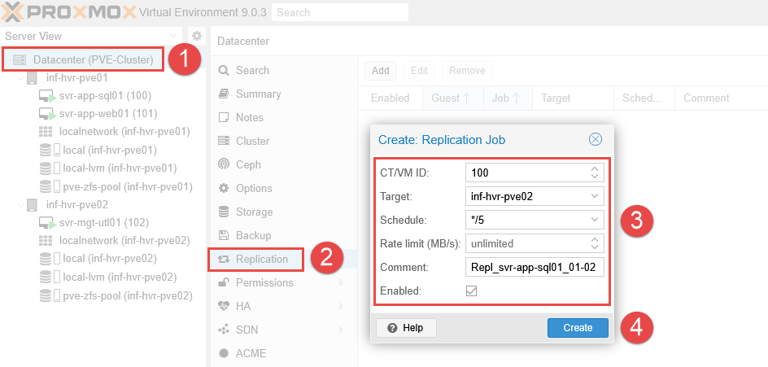
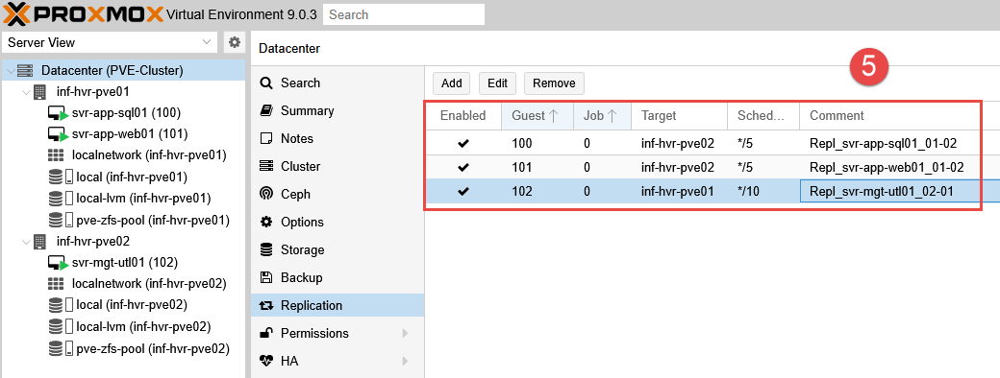
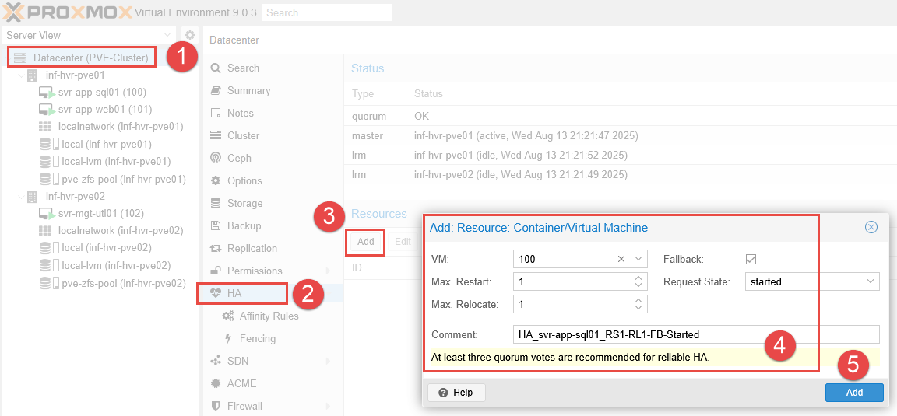
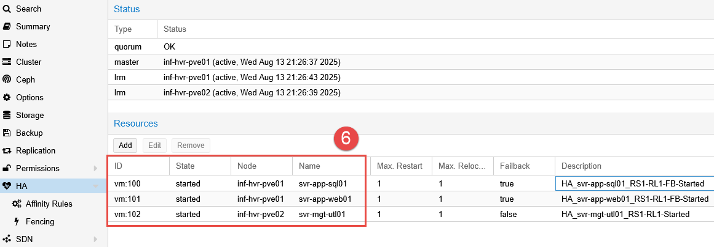
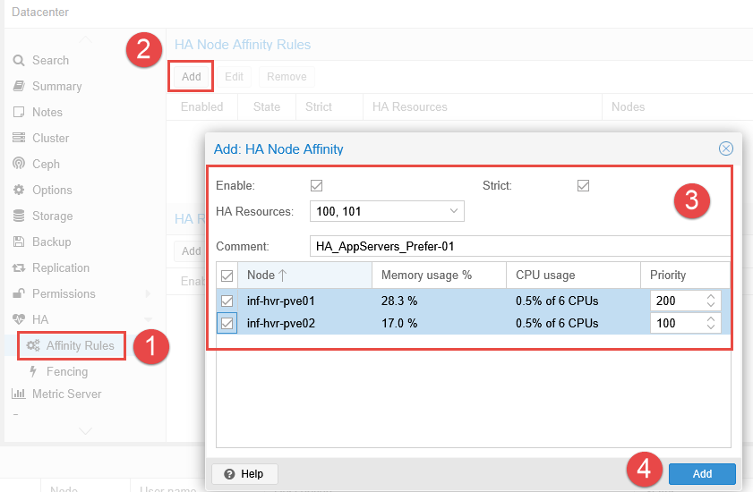
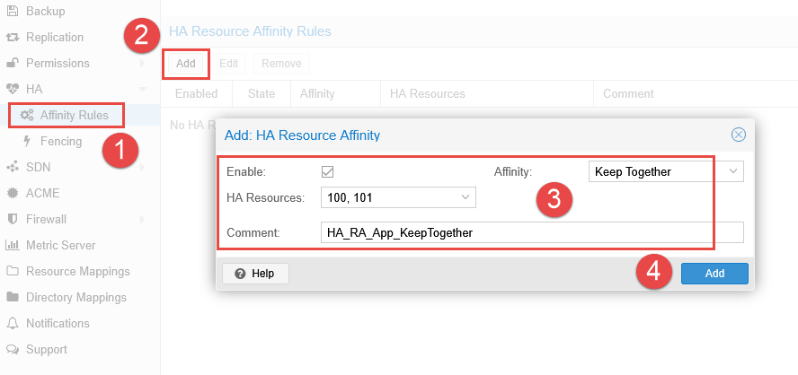
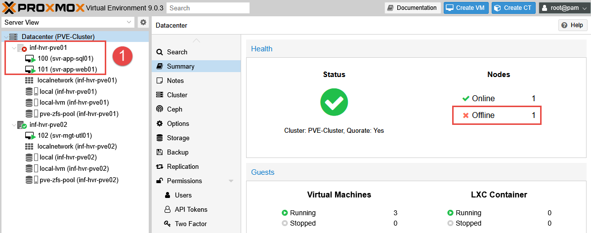
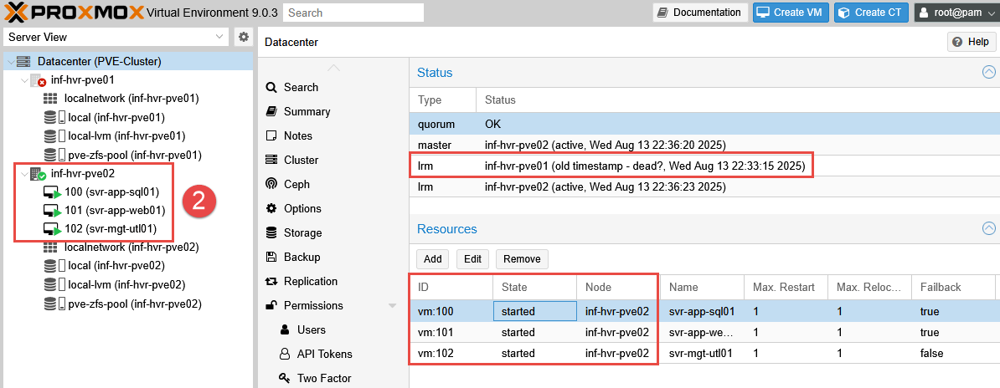
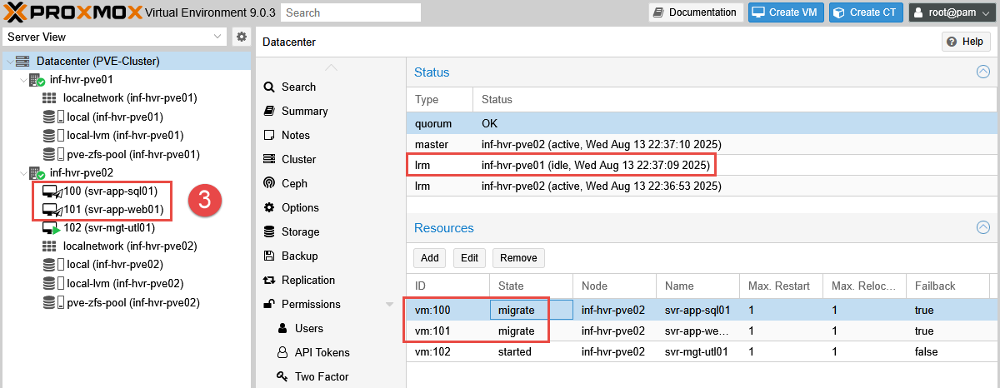

## Overview

This article describes the steps require to configure **VM replication** and **High Availability** within clustered Proxmox nodes. This will allow us to utilize **High Availability** in an environment _without_ shared storage (NAS, NFS shares etc). 

### Requirements

- An existing clustered Proxmox environment (3-node, or 2-node + Qdevice).
- Local ZFS with replication, or Shared Storage (Ceph, NFS, iSCSI, etc).

---

## Replication

**Replication** will enable a copy of the VM disk image to be stored on **both hosts**. After the initial file copy, the replication job will **periodically copy** the changes at a set interval from the source node to the targe node. 

1. Select the **Datacenter** from the left navigation panel. 
2. Select **Replication** from the menu list and click **Add*. 
3. Enter the **VM ID** number and the target Proxmox node. 
4. Provide a desired schedule, using the dropdown list to use `*/5` to set the internal to run every 5 minutes.
5. Add a comment to describe the replication job, it can be useful to include the VM name and direction of replication. 
6. Click **Create**.

6. The job will start the initial sync after the defines period of time. This may take some time as the entire disk file will need to be replicated. Once complete, the subsequent replication jobs will be delta copies, containing only the changed/new data. 
7. Repeat this process for **each VM** that requires replication enabled.

7. The VM disk images should now be visible in the ZFS storage on both Proxmox nodes. 

---

## High Availability

When using **High Availability (HA)**, if an event occurs where the Proxmox node loses connectivity, the cluster will detect the failure and order the second node to boot up the VM originally running on the first node. 

This guide will work whether you have **shared storage** or **local ZFS with replication**, however, with replication, failover won’t be instant, but it will still be automatic. The drawback with replication compared to shared storage is that the VM disk will only contain data as per the **last replication sync**. 

### Add Resources to HA

This process adds the resources (VMs) into High Availability, allowing rules to be created for them and define their behaviour during failover events. 

1. Login to the web interface and navigate to **Datacenter > HA**. 
2. Under the **Resources** section, click the **Add** button.
3. Select the first VM (only the ID will be displayed in the VM field). 
4. Modify the below settings, or leave as default.

- **Failback:** Automatically relocate the VM to the node with the highest priority according to their node affinity rules, if a node with a higher priority than the current node comes online.
- **Max Restart:** Restart attempts a resource (VM or container) will make on the same node before it's relocated to another node.
- **Max Relocate:** Number of times an HA resource will be moved to another node after failing to start on the current node.
- **Requested State:** 
	- **Started:** Start the VM (running). 
	- **Stopped:** Relocate the VM, but keep in a stopped state (do not power it on).
	- **Disabled:** Puts the VM in a stopped state, but does not attempt to relocate.
	- **Ignored:** Bypass the HA configuration, will not be relocated.

5. Enter a descriptive comment and click **Add**.

6. Repeat this process for all VMs that require HA to be enabled. 

7. The resources (VMs) have been into HA and are available for rules to be applied to them. 

### Node Affinity Rules

In Proxmox, node affinity tells the High Availability manager where to prefer a specific VM or container to run within the cluster. This is used to determine the **priority** for VM placement during normal operations and failover events. 

This works by assigning a **score** to each of the Proxmox nodes. Higher the integer, the higher the priority for the VM to run on that node. This helps to relocate VMs during failover events, targeting the higher priority nodes over the lower priority nodes. 

1. Navigate to **Datacenter > HA > Affinity Rules**.
2. Click the **Add** button in the **HA Node Affinity Rules** section. 
3. Add one or more VMs within the **HA Resources** field. Note that only VMs added to HA in the previous step will be listed.
4. Select the Proxmox nodes using the tick box and provide a **Priority** value (higher number equals higher priority). 
5. Optional: Enable **Strict** to ensure that the VMs can only run on the selected nodes. If none of the selected nodes are available, the VMs will be stopped. Otherwise, if none of the selected/preferred nodes are available, the VMs may be relocated to any other undefined node
6. Add a comment to describe the preference and purpose. 
7. Click **Add**.

8. Repeat these steps for the remaining VMs that require High Availability configured.  

### Resource Affinity Rules

This functionality allows for rules to define if specified VMs need to be kept together, or kept separate. An example use case for this could be a web application with multiple front end servers. To ensure the service is distributed, setting **Resource Affinity Rules** can ensure that each VM is running on a different Proxmox node. 

Alternatively, if two servers are part of the same service, they may need to be kept close to reduce latency during network or database communications. 

In this example, the preference is to keep both the web and database servers together. 

- **NOTE:** VMs cannot be grouped in both **Node** and **Resource** affinity rules _if_ the node affinity rule uses different priority scores for the selected nodes. For example, both selected nodes in the **Node Affinity Rule** must be of the same priority. 

1. Navigate to **Datacenter > HA > Affinity Rules**.
2. Click the **Add** button in the **HA Resource Affinity Rules** section. 
3. Select the resources within the **HA Resources** field. 
4. Choose an **Affinity** method (together or separate).
5. Add a comment to describe the preference and purpose. 
6. Click **Add**.

The HA manager service will now ensure the selected resources are run on the same node. 

---

## Testing the Failover Process

For this test, we are using only the **Node Affinity Rules** to validate our configuration and witness the failover relocation of the two "app" servers from node 1 to node 2. The rule prefers node 1 with the **failback** option enabled. This should allow the VMs to be relocated back to the preferred node after the failover event is resolved. 

### Emulated Failure

- **NOTE:** To emulate a failover event, the physical network cable from node 1 has been removed. 

With the ethernet cable pulled, the offline Proxmox node is detected within 10 seconds and visible from within the Proxmox web interface. 

Once detected, it takes some time (approximately 2-3 minutes) for the High Availability process to begin relocating the VMs - however when they are finally relocated, they are started reasonably quickly. The time delay for the relocation is longer than expected, and I plan to investigate this further (_see update to this below_). 

### Emulated Repair

To emulate the "issue" being resolved, the ethernet cable is plugged back into the first node.  
This is detected quickly, and unlike the failover relocation, the VMs begin to migrate back to the first node within 20 seconds. 

This test validates that the rules configured are performing as expected, despite the lengthy delay for the initial migration. 

**UPDATE:** After some research, it appears that the delay before the relocation of VMs may be intentional (a type of _grace period_). This allows time for the node to come back online in the event the outage is a minor network fault. 

> "ha-manager has typical error detection and failover times of about 2 minutes, so you can get no more than 99.999% availability." - [Proxmox Docs](https://pve.proxmox.com/pve-docs/ha-manager.1.html#:~:text=failover%20times)

---

## Final Steps

This concludes the series on **getting started** with the home lab environment. In future articles I will be discussing other topics such as automation of Proxmox, infrastructure as code, and exploring cloud platforms. 

---

_Cover photo by <a href="https://unsplash.com/@guerrillabuzz?utm_content=creditCopyText&utm_medium=referral&utm_source=unsplash">GuerrillaBuzz</a> on <a href="https://unsplash.com/photos/diagram-7hA2wqBcSF8?utm_content=creditCopyText&utm_medium=referral&utm_source=unsplash">Unsplash</a>_