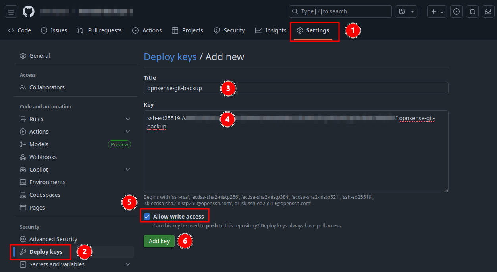
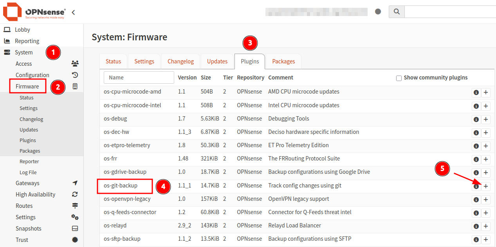
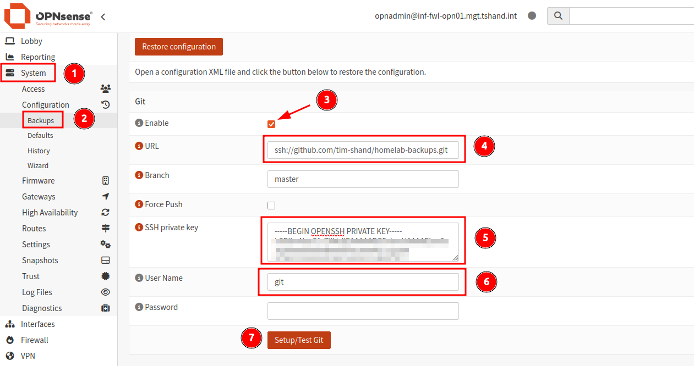
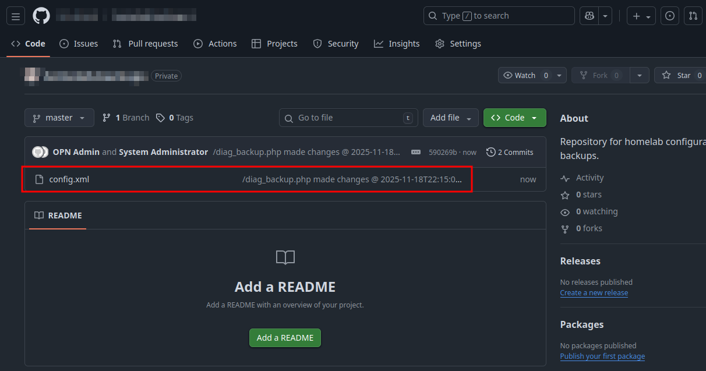

## Overview

Making configuration changes or rule updates to OPNsense does _not always_ go to plan (ask me how I know). I've found myself having to re-configure OPNsense based on fragments of my sieve-like memory on several occasions. 

Sure, I may have had some older manual config backups to use as a baseline, but without a regular, consistent backup schedule, the risk of losing hours to setup and testing is very real. 

Automating the backup of OPNsense can save plenty of time and mucking about in the event something goes "pear-shaped". 

This process utilises a downloadable plugin for OPNsense called `os-git-backup`. When using GitHub, the only available option is to use SSH for authentication as the use of HTTPS credentials is not longer accepted by GitHub. 

- **Note:** Other options available for plugin-based backups include Google Drive and SFTP. 

### Additional Information

- [OPNsense Guide for Git Backup](https://docs.opnsense.org/manual/git-backup.html)

## Requirements

- Outbound Internet access from OPNsense (required for updates and plug-in installation).
- A new **empty** GitHub repository with visibility set to **private!**
	- This must be a brand new repository, with _no_ existing files (README or LICENSE etc). 

## Enable SSH for OPNsense

**Note:** This section is **only required** if console access to the device is not available. Enabling SSH access to the OPNsense firewall will provide a means to generate the SSH key-pair. This change should only be used **temporarily**, and be reverted once this process has been completed. 

1. Navigate to the menu section `System > Settings > Administration`. 
2. Scroll down the page and locate the section `Secure Shell`.
3. Enable the `Secure Shell` tick box and optionally the root user account with password authentication. 

## Generate OPNsense SSH Key-Pair

1. Login to the OPNsense device via SSH.
2. Generate the SSH key-pair in the `.ssh` directory (created if missing).
3. The use of parameter `-n ""` ensures that no passphrase is set (required by the plugin). 

```shell
# Generate SSH key-pair in ~/.ssh directroy. 
ssh-keygen -t ed25519 -C "opnsense-git-backup" -f ~/.ssh/opnsense_git_backup -N ""
```

4. Confirm that the two files are generated in the `/root/.ssh` directory. 

```shell
# View contents of SSH directory.
ls -al ~/.ssh

# Output
-rw-------  1 root wheel 411 Nov 18 21:53 opnsense_git_backup
-rw-r--r--  1 root wheel 101 Nov 18 21:53 opnsense_git_backup.pub

```

5. Copy the output of both the private and public key (`.pub`) files for use with GitHub and OPNsense configuration. 

```shell
# View output of SSH private key file. 
cat ~/.ssh/opnsense_git_backup

# View output of SSH public key file. 
cat ~/.ssh/opnsense_git_backup.pub
```

## GitHub SSH Setup

A new, blank repository is required for this setup. This means no existing files can be present at all. If you are yet to create a new repository, do this now. Make sure not to initialise the repo with a README or LICENSE file. 

1. From within GitHub, access the new repository.
2. Navigate to the repository `Settings` and select `Deploy Keys`. 
3. Click `Add Deploy Key`. 
4. Add the SSH public key to the `key` section, enable `Allow Write Access`.
5. Click `Add Key`. 



## OPNsense Backup Configuration

1. From inside the OPNsense web GUI, navigate to the menu item `System > Firmware > Plugins`. 
2. Locate the plugin named `os-git-backup` and click the `+` icon to install it. 



3. Once installed, navigate to `System > Configuration > Backups`. 
4. A new menu section named `Git` should now be available. 
5. Enable the `Git` backup service. 



6. Add the SSH URL and primary branch for your new GitHub repo (`master` by default). 
7. Add the private SSH key in the required field. 
8. For SSH connections to GitHub, the user should be set as `git` with **no password** defined (using SSH keys). 
9. Click `Setup/Test Git` to confirm. 
10. The page should refresh followed with a top header message `Backup successful, current file list:  config.xml`. 
11. The OPNsense `config.xml` file should now be visible in the GitHub repository. 



---

_Cover photo by <a href="https://unsplash.com/@jandira_sonnendeck?utm_source=unsplash&utm_medium=referral&utm_content=creditCopyText">Jandira Sonnendeck</a> on <a href="https://unsplash.com/photos/a-close-up-of-a-disc-with-a-toothbrush-on-top-of-it-AcW1ZwD-qC0?utm_source=unsplash&utm_medium=referral&utm_content=creditCopyText">Unsplash</a>_