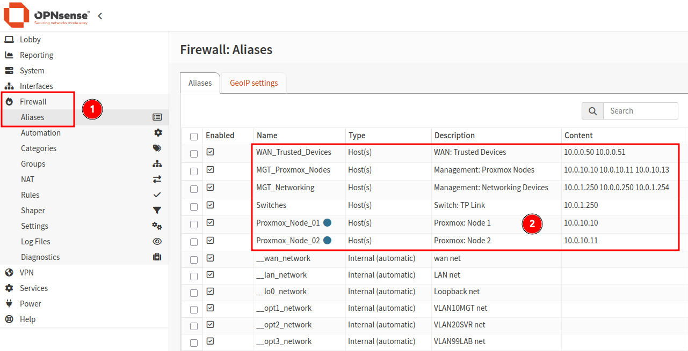
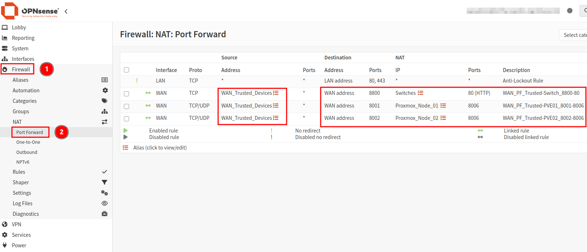
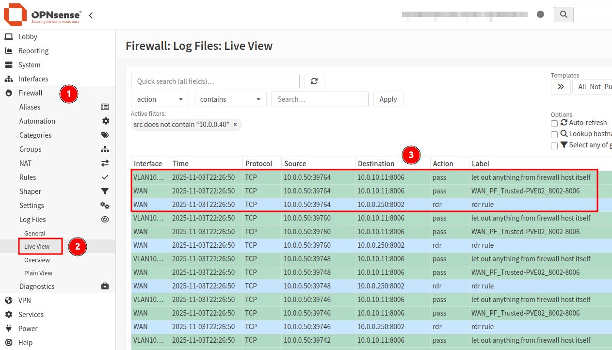

## Overview

This project involves using aliases for both the Proxmox hosts and a list of approved (trusted) IP addresses to access them. 

- **Note:** Using aliases is not required, however it does make management much easier. Individual IP addresses can be used instead if preferred. 

## Aliases

An alias group allows us to group a list of IP addresses and assign a rule to the group within a single firewall rule entry. 

Using aliases can make configuring the firewall rules much easier as we can create rules for a single alias group, rather than multiple rules per IP address.
As the approved WAN devices that I want to use for accessing the internal resources are outside the LAN/VLAN network, we need to create firewall rules with port forwarding to allow the inbound connection from one alias group to another.

**Create the alias groups for both the trusted WAN devices and the Proxmox nodes.**  

1. Navigate to `Firewall > Aliases`.
2. Click the plus icon to create a new entry.
3. Add an alias for the Proxmox hosts. 
4. Click `Save`, followed by `Apply`.

```
Name: MGT_Proxmox_Nodes
Type: Host(s)
Content: Proxmox host LAN IP addresses (10.0.10.10, 10.0.10.11, 10.0.10.13)
Description: Management: Proxmox Nodes
```

- Repeat the above steps for trusted WAN devices (personal laptop etc).

```
Name: WAN_Trusted_Devices
Type: Host(s)
Content: Approved device IP addresses (10.0.0.50, 10.0.0.51)
Description: WAN: Trusted Devices
```



## Port Forwarding Firewall Rules

With the aliases configured, we can proceed to create the firewall rules that will allow inbound traffic from trusted WAN devices, to the WAN IP address, which will then forward the traffic to the Proxmox nodes on the selected port defined by the rules. 

**Example:**  
```
Laptop [10.0.0.50] --> OPNsense WAN [10.0.0.250]:8001 --> Proxmox Node 1 [10.0.10.10]:8006
Laptop [10.0.0.50] --> OPNsense WAN [10.0.0.250]:8002 --> Proxmox Node 2 [10.0.10.11]:8006
Laptop [10.0.0.50] --> OPNsense WAN [10.0.0.250]:8800 --> Switch [10.0.1.250]:80
```

1. Navigate to `Firewall > NAT > Port Forward`.
2. Click the `+` icon to create a new Port Forwarding rule. 
3. Populate the rule settings as per below. 
4. Click `Save`, followed by `Apply`.

**Rule 1: Port Forward OPNsense WAN:8001 to Proxmox Node 1**  
```
Action: PASS
Interface: WAN
Direction In
TCP/IP Version: IPv4
Protocol: TCP/UDP
Source: WAN_Trusted_Devices (alias group from previous step)
Destination: WAN address
Desination Port Range: 8001 (other)
Redirect Target IP: Proxmox_Node_01 (alias from previous step)
Redirect Target Port: 8006 (default Proxmox web port)
Pool Options: ** Leave default, unless wanting to use round robin for node selection **
Log: Enabled (helpful for validation)
Description: WAN_In_Allow_Trusted-PVE01_8001-8006
* Leave all other settings default*
```

**Rule 2: Port Forward OPNsense WAN:8002 to Proxmox Node 2**  
```
Action: PASS
Interface: WAN
Direction In
TCP/IP Version: IPv4
Protocol: TCP/UDP
Source: WAN_Trusted_Devices (alias group from previous step)
Destination: WAN address
Desination Port Range: 8002 (other)
Redirect Target IP: Proxmox_Node_02 (alias from previous step)
Redirect Target Port: 8006 (default Proxmox web port)
Pool Options: ** Leave default, unless wanting to use round robin for node selection **
Log: Enabled (helpful for validation)
Description: WAN_In_Allow_Trusted-PVE02_8002-8006
* Leave all other settings default*
```



## Validation

This should now allow the WAN devices with IP addresses listed in the `WAN_Trusted_Devices` alias to connect to the Proxmox hosts listed in the `MGT_Proxmox_Nodes` alias group via the OPNsense WAN IP address and asigned port number.

If logging is enable for the rules, these requests should be visible in the OPNsense firewall logs with a `RDR` (redirect) action type. 



---

_Cover photo by <a href="https://unsplash.com/@freeche?utm_source=unsplash&utm_medium=referral&utm_content=creditCopyText">Kvistholt Photography</a> on <a href="https://unsplash.com/photos/photo-of-computer-cables-oZPwn40zCK4?utm_source=unsplash&utm_medium=referral&utm_content=creditCopyText">Unsplash</a>_
