## Overview

This article describes the steps used to configure multiple VLANs for both OPNsense and a physical switch connected to the LAN-side of the OPNsense firewall. The purpose of introducing VLANs to my homelab environment is to separate the LAN network into dedicated logical networks, providing improved security and reducing broadcast traffic for each of the networks. Prior to this project, all devices were members of the default LAN. 

### What is a VLAN?

Virtual Local Area Networks (VLANs) allow the splitting of a physical network into multiple logical networks. This helps to group devices and workloads logically, allowing for dedicated networks per device group or environment, with each VLAN acting as a security boundary. VLANs are quite commonly used with home and commercial wireless networks to provide separate main and guest WiFi networks. 

### Benefits 

- Easier to assign policies, DHCP ranges, firewall rules, etc.
- Isolate untrusted devices such as lab VMs, or guest devices.
- Reduce the blast radius if a device or subnet becomes compromised.
- Implement fine-grained firewall rules between VLANs using OPNsense.
- Reduces hardware requirements, no need to extra switches or NICs.
- Less ARP/broadcast noise on each subnet.
- Better performance and lower latency. 

### How do VLANs work?

VLANs work by adding a 4-byte label to Ethernet frame headers so that VLAN capable switches and devices can recognize which logical network (VLAN) the frames belong to. The Ethernet frames can be **tagged** or **untagged**. 

**Tagged:**  
- Ethernet frame contains a VLAN ID in its header. Used between **VLAN-aware** devices (switches, wireless APs, routers). 
- If the Ethernet frame is **tagged**, the VLAN ID tells the switch which VLAN it belongs to.
- Labeled traffic for VLAN-aware links.

**Untagged:**  
- Ethernet frame has no VLAN ID. Typically used by end-user devices, computers, phones consoles that are not VLAN-aware.
- If the Ethernet frame is **untagged**, the switch uses the **PVID** (Port VLAN ID) to decide which VLAN to assign the frame to.
- When an untagged frame arrives, the switch tags it with the port’s PVID so it can be forwarded within that VLAN. 
- When a frame leaves an access port, the switch removed the VLAN tag before sending it to the device.

**PVID:**  
- The default VLAN ID (native VLAN) the switch uses to assign to untagged Ethernet frames. 
- PVID only matters if something sends untagged traffic to the port. 
- Every switch port has a PVID set to assign a native VLAN to untagged traffic. 

**Access Port:**  
- Carries a single VLAN, frames sent and received are untagged. 
- Switch assigns all incoming untagged traffic to the VLAN defined by the PVID setting.

**Trunk Port:**  
- Carries multiple VLANs, frames received are tagged. 
- All VLANs on a trunk are sent as tagged frames.
- Can define a single VLAN for untagged using the PVID method. 

---

## Design 

This design will create a separation of the `management` portion of the network from the default LAN (native VLAN 1). This management VLAN will contain Proxmox nodes and other future devices related to virtualization or storage. 

Virtual servers (VMs) will reside on separate dedicated VLANs 20 and 99, ensuring they remain separate from the management VLAN. In some cases, firewall rules will be added to allow specific traffic to flow between the VLANs for purposes such as monitoring, backup or other tasks that require traffic to enter another VLAN. 

This design will utilize IPv4 only. 

**Design Layout:**  

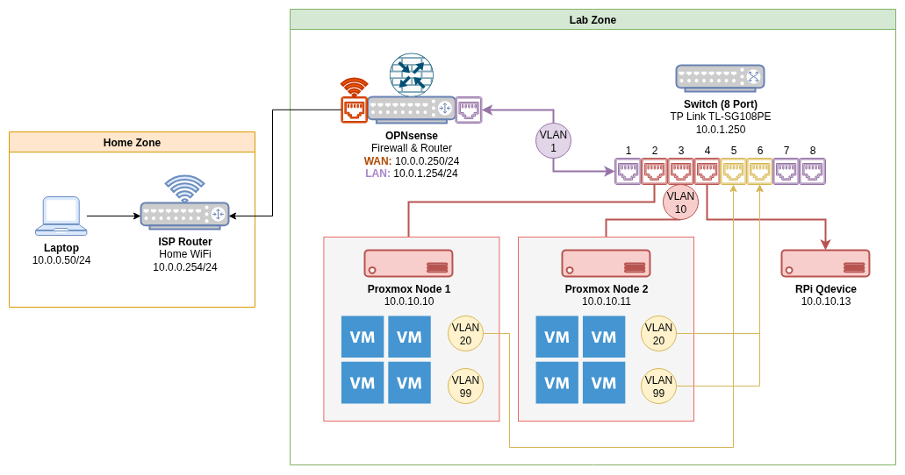

```
[ISP Router]
    |
 (WiFi link)
    |
[OPNsense Firewall]
  - WAN (10.0.0.250/24 via WiFi client)
  - LAN (VLAN trunk to switch)
        |
        +--- [TP-Link TL-SG108PE]
             |  Port 1 → OPNsense LAN (Trunk)
             |  Port 2 → Proxmox Node 1 (vmbr0)
             |  Port 3 → Proxmox Node 2 (vmbr0)
             |  Port 4 → Raspberry Pi (QDevice for Proxmox)
             |  Port 5 → Proxmox Node 1 (USB NIC for tagged VLANs)
             |  Port 6 → Proxmox Node 2 (USB NIC for tagged VLANs)
             |  Port 7 → Empty (LAN) [Native VLAN 1]
             |  Port 8 → Empty (LAN) [Native VLAN 1]
```

**Networks:**  

| VLAN | Name       | Subnet        | Purpose                    |
| ---- | ---------- | ------------- | -------------------------- |
| –    | WAN        | 10.0.0.250/24 | ISP router uplink          |
| –    | LAN        | 10.0.1.0/24   | Default untagged LAN       |
| 10   | VLAN10-MGT | 10.0.10.0/24  | Management (Proxmox)       |
| 20   | VLAN20-SVR | 10.0.20.0/24  | Prod Servers (VMs)         |
| 99   | VLAN99-LAB | 10.0.99.0/24  | Testing/Lab VMs            |

## Configuration: OPNsense VLANs

### Create VLAN Interfaces

From within OPNsense, navigate to `Interfaces > Assignments`. Take note of the device connected to the LAN interface. This same interface will be used as the _parent_ for the VLAN assignments. 

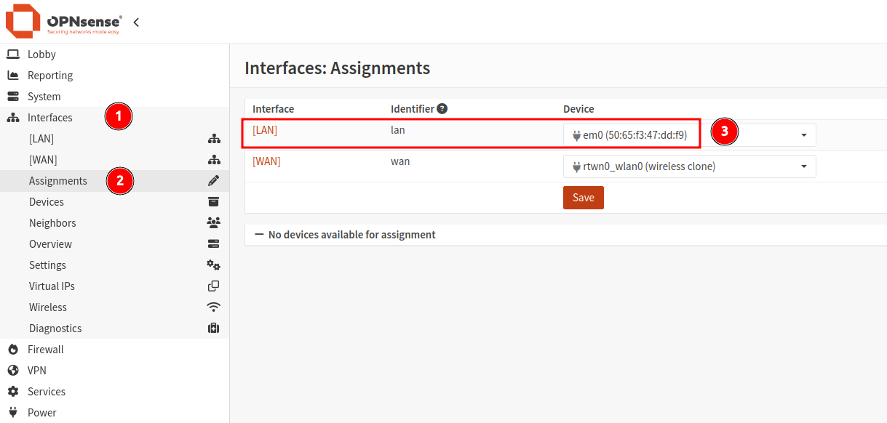

1. From within the `Interfaces` menu section, navigate to `Devices > VLAN`. 
2. Click the `+` icon to create a new VLAN.
3. Enter the VLAN name (starting with "vlan0"), providing a tag ID number and description. 
4. Ensure to select the LAN device as the parent of this interface. 
5. Click save to create the VLAN interface. 
6. Repeat this process for all required VLANs. 

When all VLANs have been added, click `Apply`. 

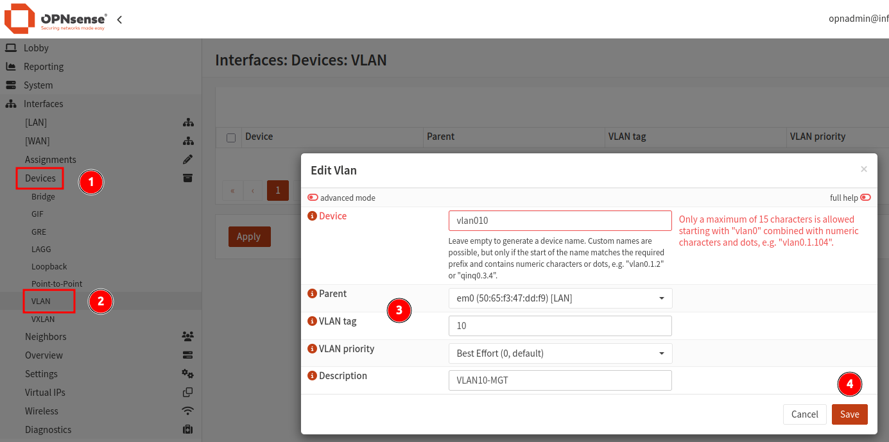

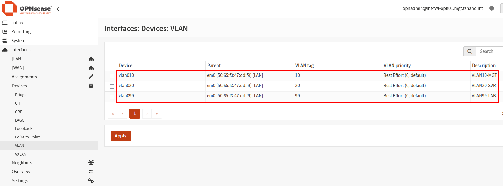

### Assign VLAN Interfaces

1. Navigate to `Interfaces > Assignments`. 
2. Under the section `Assign a new interface`, select the first VLAN interface. 
3. Provide a description in the text box provided - this will be used as the display name for the interface. 
4. Repeat this process until all VLANs have been assigned. 

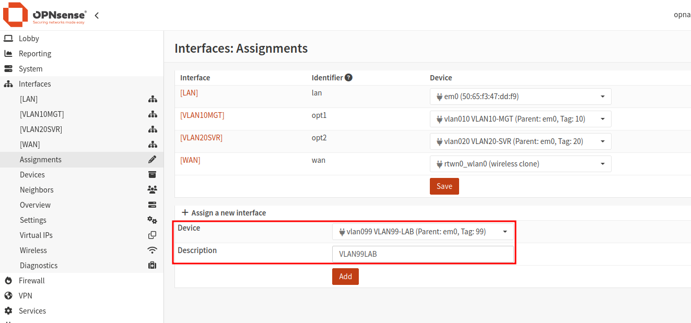

### Configure VLAN Interfaces

This step is required to be performed for each VLAN interface created. 

1. Navigate to `Interfaces > [SELECT VLAN]`. 
2. Enable the interface using the check box provided.
3. Set the `IPv4 Configuration Type` to `Static IPv4`. 
4. Enter an IP address to be used by the VLAN gateway, including the subnet mask (/24 in this case).
5. Unless required, leave all other options as defaults.
6. Click `Save`, followed by `Apply Changes`. 

### Setup DHCP (Optional)

- **Note:** If the automatic providing of IP addresses (DHCP) is _not_ required, skip this step. 

1. Navigate to `Services > Dnsmasq DNS & DHCP`.
2. Select the menu item `DHCP Ranges`. 
3. Click the `+` icon to create a new DHCP range. 
4. Select the VLAN interface, providing both a starting and ending IP address with optional domain name. 
5. All other setting can be left as defaults. 
6. Click `Save`. Repeat for each of the remaining VLANs. 
7. Once all VLAN DHCP ranges have been added, click `Apply`. 

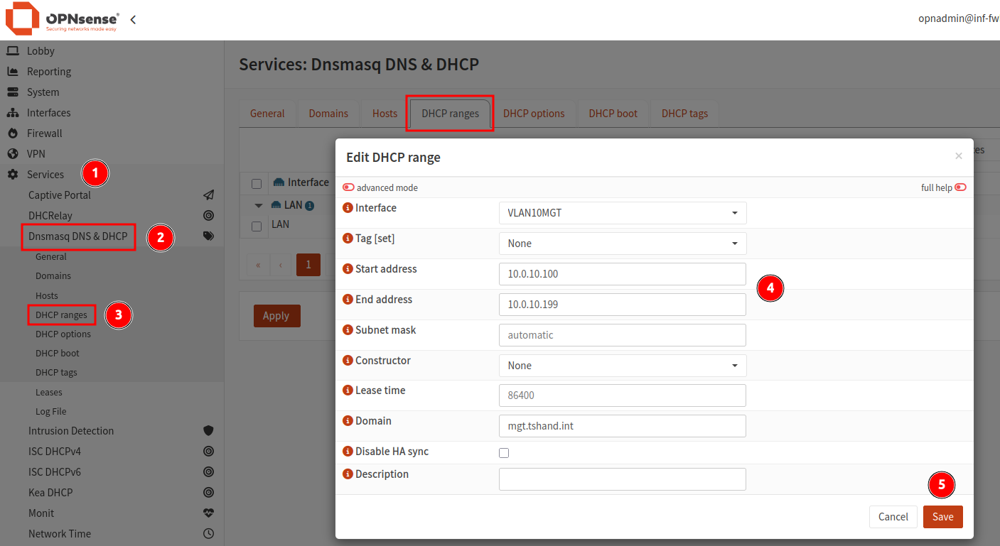

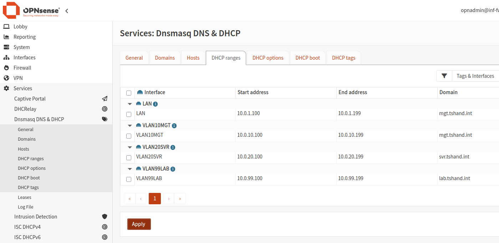

Configure the DHCP server to "listen" on all required VLAN interfaces. Without this enabled, no DHCP addresses will be provided. 

1. Navigate to `Services > Dnsmasq DNS & DHCP > General`.
2. Under the `Interface` dropdown, select all VLANs that require DHCP.
3. Scroll to the bottom of the page, and click `Apply`. 

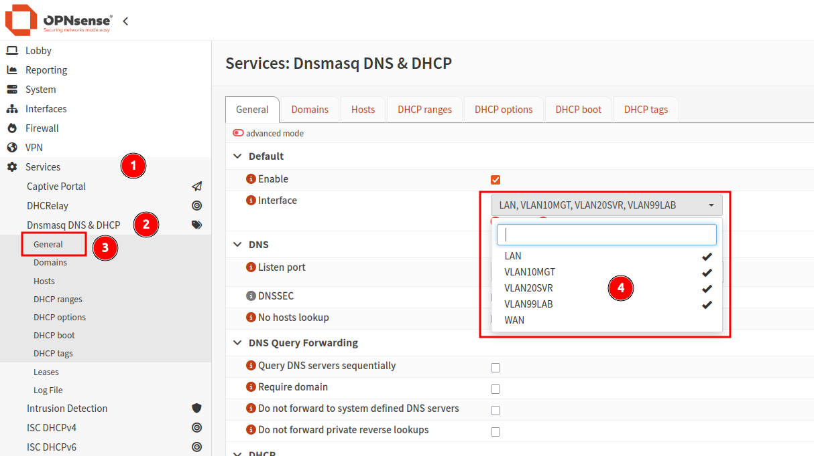

---

## Configuration: Switch VLANs

My TP Link TL-SG108PE switch provides support for 802.1Q VLAN tagging, along with port based VLAN configuration via the web UI. 

- **Note:** Some switch manufacturers use different naming and terminology to refer to similar concepts. Consult your user guide if clarification is required. 

Although Proxmox can be configured to use specific VLAN tags for the host communication (default bridge vmbr0 can be set to "vlan-aware"), I chose to use a port-based VLAN tagging approach (via PVID setting) as the switch ports will always be dedicated to the Proxmox hosts.

As the Proxmox nodes connected to ports 2 and 3 (with QDevice on port 4) are not tagging their traffic, they will use the tag value set in the PVID configuration. 

Using the PVID setting allows for setting the VLAN ID on that port for untagged traffic. This means that when a device not configured to use a specific VLAN ID is connected to that port, it will be assigned to the VLAN configured under this setting. 

- **Note:** The PVID defines the default VLAN ID assigned to any untagged incoming traffic on that switch port. 

**Switch - 802.1Q VLAN:**  

| VLAN | VLAN Name  | Member Ports | Tagged Ports | Untagged Ports |
| ---- | ---------  | ------------ | ------------ | -------------- |
| 1    | Default    | 1,5-8        |              | 1,5-8          |
| 10   | VLAN10-MGT | 1-4          | 1            | 2-4            |
| 20   | VLAN20-SVR | 1,5-6        | 1,5-6        |                |
| 99   | VLAN99-LAB | 1,5-6        | 1,5-6        |                |

**Switch - 802.1Q PVID (Port VLAN ID) Setting:**  

| Port | PVID |
| ---- | -----|
| 1    | 1    |
| 2    | 10   |
| 3    | 10   |
| 4    | 10   |
| 5    | 1    |
| 6    | 1    |
| 7    | 1    |
| 8    | 1    |

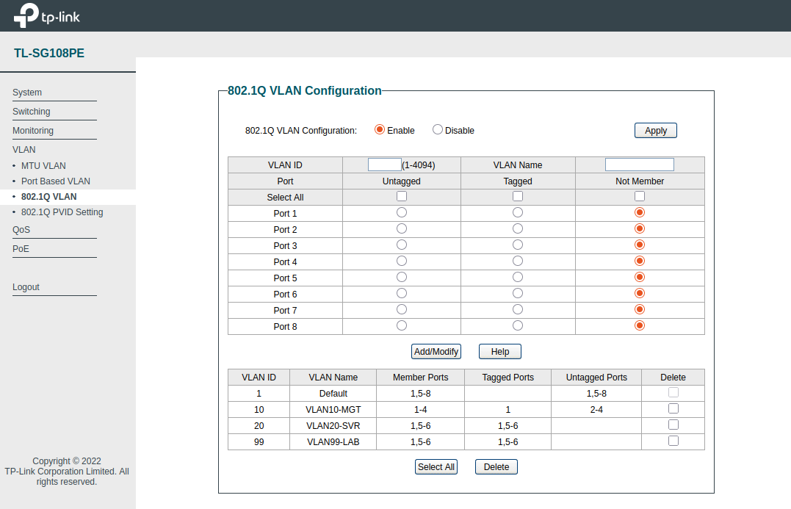

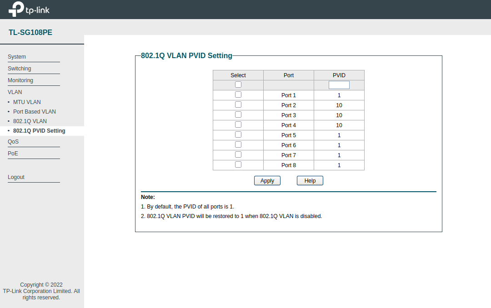

---

## Configuration: OPNsense Firewall Rules

By default, newly created interfaces do not have any rules allowing inbound traffic. Rules must be created to enable traffic flow between VLANs and gateway addresses. 

- **Note:** When DHCP server is enabled on the VLAN interfaces, default rules are automatically added to allow for communication - no additional rules should be needed to enable traffic for DHCP services. 

1. Within OPNsense, navigate to `Firewall > Rules > VLAN10MGT`. 
2. By default, no custom rules should be present. Click the `+` icon to create a new rule.
3. Add the required configuration as per below, repeat for remaining VLANs.

**Allow internal communication:**  
```
Action: Pass
Interface: VLAN10MGT
Direction: in
TCP/IP Version: IPv4
Protocol: Any
Source: VLAN10MGT net (whole network for VLAN10)
Destination: Any
Log: Enabled
Description: VLAN10_In_Allow_VLAN10-Any_All
```

**Block VLAN99 (Lab) to VLAN10 (Management):**  
```
Action: Block
Interface: VLAN99LAB
Direction: in
TCP/IP Version: IPv4+IPv6
Protocol: Any
Source: VLAN99LAB net (whole network for VLAN99)
Destination: VLAN10MGT net (include VLAN20, LAN if needed)
Log: Enabled
Description: VLAN99_In_Block_VLAN99-VLAN10_All
```

---

## Testing Connectivity

### A Note on Layer-2 Communication

As I was messing about with testing firewall block rules, I noticed that the Proxmox nodes were not affected. After a bit of research, I found that devices within the same VLAN, are in the same broadcast domain and the same **Layer 2** segment. The switch handles the communication by forwarding frames based on their destination MAC addresses, _without_ needing to involve a **Layer 3** device (router or firewall, **aka OPNsense**).

Therefore, inbound traffic from Proxmox Node 1 (10.0.10.10) to Node 2 (10.0.10.11) will bypass the OPNsense firewall. Since both IP addresses reside on the same VLAN, the switch forwards the frames directly from port 2 to port 3. OPNsense only enforces firewall rules on traffic that passes **through** its interfaces.

### Ping Test

Now with all the required configuration in place, running some test pings to the other VLAN interfaces from a Proxmox node shows successful results. 

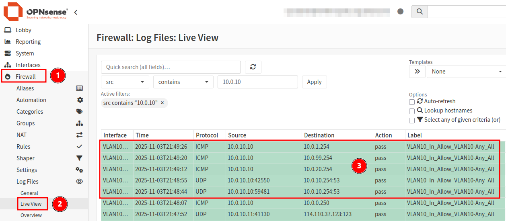

While open rules make testing and log reviews much easier, narrowing down firewall rules to only the minimum requirements will improve security posture and reduce risk. 

---

_Cover photo by <a href="https://unsplash.com/@jouwdan?utm_source=unsplash&utm_medium=referral&utm_content=creditCopyText">Jordan Harrison</a> on <a href="https://unsplash.com/photos/blue-utp-cord-40XgDxBfYXM?utm_source=unsplash&utm_medium=referral&utm_content=creditCopyText">Unsplash</a>_
